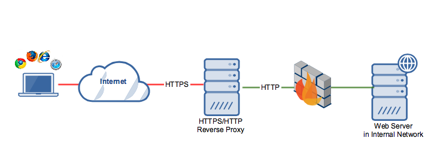

# Basisopdracht

## Algemeen

Voor de basisomgeving gebruik je een domeinnaam met volgende structuur:

```text
<groepsafkorting>-<vestigingsnaam>.internal
```

:exclamation: **Let op**: Als voorbeeld wordt er in dit document telkens gebruikt gemaakt van `l01-thematrix.internal` (de `l` van "lectoren"). Vervang dit steeds door jullie eigen domeinnaam (bv. `g03-syndus.internal` voor groep 3 uit Gent of `a02-aralis.internal` voor groep 2 uit Aalst).

- Leg eerst en vooral een IP-adrestabel vast voor alle componenten in het netwerk die dit nodig hebben. De specificaties voor de adressen vind je hieronder.
- De serverinfrastructuur bestaat uit virtuele machines (VMs) gebaseerd op een evenredige mengeling van Windows Server en de laatste versie van AlmaLinux. Servers bestaan enkel uit CLI gebaseerde VMs, een GUI is hier immers overbodig.
- Installatie en configuratie van de Windows systemen gebeurt deels in de GUI en deels aan de hand van PowerShell scripts. Op de Linux-systemen gebeurt dit **volledig** met Vagrant en bash-scripting. Wil je dit anders aanpakken, dan moet je dit eerst overleggen met de technische coaches.
- Containertechnieken zoals docker, docker compose, podman, LXC, ... zijn niet toegelaten. Tools zoals Puppet, Ansible, ... zijn ook niet toegelaten. Het doel is dat je zelf de scripts uitwerkt.
- Zorg ervoor dat alle scripts herbruikbaar zijn. Hiermee bedoelen we dat je "hard-coded" waarden vermijdt, maar in plaats daarvan overal variabelen gebruikt. De systeembeheerder kan de gewenste waarden invullen in een configuratiebestand dat ingelezen wordt door je scripts, of (in het geval van een PowerShell-script) via een dialoogvenster bij de uitvoering van het script.
- Schrijf testplannen met exacte procedures die toelaten te valideren of een deeltaak is uitgevoerd volgens de specificaties.
- Een ander teamlid volgt de instructies van de testplannen en schrijft een testrapport over het resultaat. Indien er tests falen, wordt een ticket aangemaakt in het kanban bord (met een link naar het rapport) zodat de verantwoordelijke de fout kan oplossen.

## Netwerk

Het netwerk en alle servers worden uitgewerkt met IPv4; IPv6 is een challenge. Plan vooraf de nodige subnetten en verspil geen IP-adressen. Alle subnetten kies je binnen de vastgelegde range 192.168.10**X**.0/24, waarbij 10**X** staat voor jullie groepsnummer vermeerderd met 100. De default gateway die de ISP (zie onder) bij iteratie 1 zal gebruiken is 192.168.10**X**.254/30, en komt dus uit jouw eigen range van adressen! Jouw uplink interface gebruikt 192.168.10**X**.253/30.

### Basisnetwerk - iteratie 1

Alle servers die je opzet maken gebruik van dit netwerk. Je simuleert dit netwerk in [Packet Tracer](https://www.netacad.com/portal/resources/packet-tracer), en test de (deels geautomatiseerde) uitrol op de netwerkapparatuur in het leslokaal. In een eerste iteratie baseer je jou op de kennis verworven in 'Computer Networks 2'.

- Voorzie VLANs voor servers, employees en DMZ:
  - VLAN 42 Interne servers
    - Vaste, private IP-adressen
    - De IP-adressen corresponderen met de adressering van de servers.
  - VLAN 11 Werkstations employees
    - Dynamische, private IP-adressen (via DHCP)
    - Kunnen interne servers en Internet bereiken
  - VLAN 13 DMZ
    - Vaste, private IP-adressen
    - Is bereikbaar vanop Internet; is ook bereikbaar vanuit de VLAN van de employees
    - Kan zelf ook de nodige servers binnen de VLAN van de Interne servers bereiken - maar enkel de nodige!
  - VLAN 1 Network Management
    - Vaste, private IP-adressen voor de netwerktoestellen (switch, router, TFTP-server (zie onder))
    - Enkel toegankelijk voor de TFTP-server - hoe ga je dit beveiligen (zie \*1)?
- Inter-VLAN routing wordt uitgevoerd met een **router-on-a-stick** configuration.
- Simuleer de netwerkinfrastructuur met Packet Tracer. Na succesvolle simulatie worden dezelfde configuraties **geïmporteerd** op de apparatuur in het netwerklokaal, en worden de (virtuele) servers aangesloten tot één werkend geheel.
  - De configuraties van de netwerktoestellen worden vanaf een **TFTP-server** (zie Linux) opgeladen [^5] - manuele aanpassingen nadien zijn te vermijden en stel je bij in de configs op deze TFTP-server!
  - In de eerste iteratie van jouw set-up stuur je het verkeer door naar een default ISP-router, opgezet door de lectoren. De **static routes** die de ISP moet configureren naar jouw router worden doorgeven aan de netwerk-lector.
- De gehele opstelling wordt lokaal uitgevoerd met VMs en de aanwezige apparatuur in het netwerklokaal.
  - De VMs draaien op de laptops van de studenten - je switcht de VM naar **bridged mode** als je hem aansluit op je eigen netwerk. Als er meerdere VM's op een enkele laptop moeten draaien: denk goed op voorhand na over deze verdeling (CPUs, RAM) om performantiebottlenecks en andere problemen te vermijden.

[^5]: Zie extra Packet Tracer oefening: "PT Backing Up Configuration Files using TFTP".

### Basisnetwerk - iteratie 2

In een tweede iteratie baseer je jou op de kennis verworven in 'Computer Networks 3'. Deze zaken zal je pas kunnen implementeren nadat in dit vak de relevante lessen gegeven zijn.

- Configureer zelf NAT op je uplink router, die als publiek adres een IP-adres uit de netwerk-range van het leslokaal gebruikt (automatisch ingesteld via DHCP, de router wordt hier client!). Het subnetwerk (.252/30) naar de ISP-router uit iteratie 1 verdwijnt dan uit de set-up.
- (\*1) Werk de Cisco router bij met de nodige Access Control Lists (ACLs) om het netwerk te beperken. Bouw deze firewall regels op vanuit het 'principle of least privilege': enkel de gekende communicatie tussen de drie netwerken wordt toegelaten; andere subnets en poorten worden by default geweigerd.
- Blijf (vanzelfsprekend) werken met configuraties die, na het booten van de netwerktoestellen, opgeladen worden vanaf de TFTP-server - je kan jezelf vermeien met deze semi-geautomatiseerde manier van werken!

## Windows servers

Windows Servers bestaan enkel uit **CLI** gebaseerde VMs, een GUI is hier immers overbodig. De VMs zijn te benaderen via RSAT vanop een Windows GUI **client** VM.

### Domain Controller

- Binnen jullie organisatie moeten al jullie systemen centraal beheerd worden. Hiervoor moeten jullie een Active Directory Domain opzetten, gecontroleerd door een Domain Controller (DC). Elk Windows toestel moet deel uitmaken van dit domain.
- Op deze DC draait Windows Server 2022 Standard als OS. Er is dus geen grafische interface aanwezig, enkel een CLI. Zorg er wel voor dat je een Windows Client (Windows 10/11) hebt binnen je domain met daarop de nodige RSAT-tools zodat je toch een grafisch overzicht hebt van de serverconfiguratie.
- Gebruik `ad.l01-thematrix.internal` als root domain voor Active Directory. Zo vermijd je conflicten met de webserver (zie verder).
- Stel een logische domainstructuur voor jullie organisatie op waarbinnen alle toestellen en gebruikers zijn ondergebracht. Gebruik dus niet de standaard containers die automatisch worden aangemaakt door Windows Server.
- Zorg ervoor dat de PC's en servers geen lokale gebruikers hebben, maar dat de authenticatie gebeurt via de DC. Verdeel de gebruikers in groepen met verschillende rechten. Denk hier zorgvuldig over na en zorg ervoor dat je bij minstens één gebruikersgroep afdwingt dat ze op bepaalde toestellen niet kunnen inloggen. Doe dit aan de hand van een Group Policy.
- Voorzie voor elke gebruiker een shared folder op deze DC.
- De Domain Controller is ook de DNS-server van het domain. Zorg ervoor dat deze alle DNS-queries binnen het domain kan beantwoorden. Voorzie dus de nodige A-records, PTR-records en CNAME-records voor de verschillende servers en clients. Queries voor andere domainen moet de DC doorsturen naar een forwarder naar keuze.
- Automatiseer dit alles zoveel mogelijk. Gebruik hiervoor scripts met VboxManage om de VM's aan te maken in Virtualbox, en PowerShell-commando's om de VM's nadien te configureren.

### Linux servers

- Gebruik voor alle Linux VM's de laatste versie van AlmaLinux op dit moment. Installeer geen GUI. Alle servers mogen **enkel over een CLI** beschikken.
- Schakel SELinux niet uit.
- Linux VMs zijn benaderbaar via SSH. Zorg ervoor dat je **nooit** met het root account kan inloggen en dat je **enkel** door middel van SSH keys kan inloggen (dus niet door een gebruikersnaam en wachtwoord in te geven).

#### Databank

- Installeer een databank naar keuze (bv. MariaDB, PostgreSQL, ...). Deze zal gebruikt worden voor de CMS (zie verder).
- Enkel poorten nodig voor de databank en SSH mogen open staan in de firewall.
- Configureer de databank zodat deze enkel connecties aanvaardt van (het IP-adres van) de webserver. M.a.w. enkel de webserver kan connecteren op de databankpoort. Databank clients op andere devices worden sowieso geweigerd.

#### Webserver

- Installeer een webserver naar keuze (bv. Nginx, Apache, ...)
- Installeer op deze server een CMS (content management system) naar keuze (bv. Drupal, Wordpress, ...). De CMS moet gebruik maken van de databank op de databankserver.
- Zorg ervoor dat je kan inloggen en een post kan aanmaken.

#### Reverse proxy

- Plaats in de DMZ een reverse proxy naar keuze (Nginx, Apache, ...).
- HTTP**S** gaan we niet instellen op de webserver. In dit netwerk wordt dit de taak van de reverse proxy. De webserver is dus niet rechtstreeks van buitenaf bereikbaar, maar enkel via de reverse proxy. Maak gebruik van self-signed certificates voor HTTPS zodat je vanop elk werkstation naar deze webserver surfen zowel met of zonder het "www" voorvoegsel ( https://www.l01-thematrix.internal/ en https://l01-thematrix.internal/ ). Bekijk onderstaande figuur: er is dus enkel een HTTPS-verbinding tussen client en reverse proxy. Tussen de reverse proxy en de webserver is er enkel een HTTP-verbinding. 
- Zorg ervoor dat de reverse proxy HTTP/**2** over TLS gebruikt.
- Zorg ervoor dat, als de webserver gescand wordt met nmap, deze geen informatie geeft over de versie van de server.

#### TFTP-server

- Installeer een TFTP-server naar keuze.
- Netwerktoestellen worden via deze TFTP-server geconfigureerd (zie boven).
- De automatische installatie kopieert de netwerkconfiguraties naar de juiste map op deze server.
