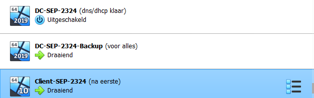

# Testplan: Backup Windows Server

- Auteur(s) testplan: Matteo Alexander

**Opgelet**: de output kan verschillen in een echte opstelling, het gegeven "Verwacht resultaat" voor een test is slechts een placeholder voor een mogelijk geldige output. 


## Opstellen omgeving

1) Zorg ervoor dat de Client, Windows Server, Backup Windows Server draaien en dat alle scripts erop zijn uitgevoerd. Zorg ook dat de db, web, rp actief zijn zodat de eigen site bereikt kan worden.

2) Zorg dat de Client een ip adres heeft gekregen adhv dhcp van de Windows server. Zorg dat de secundaire DHCP server is ingesteld op: 192.168.107.152
```bash
C:\Users\Administrator>ipconfig /all

Windows IP Configuration

   Host Name . . . . . . . . . . . . : Client-SEP-2324
   Primary Dns Suffix  . . . . . . . : ad.g07-blame.internal
   Node Type . . . . . . . . . . . . : Hybrid
   IP Routing Enabled. . . . . . . . : No
   WINS Proxy Enabled. . . . . . . . : No
   DNS Suffix Search List. . . . . . : ad.g07-blame.internal

Ethernet adapter Ethernet:

   Connection-specific DNS Suffix  . :
   Description . . . . . . . . . . . : Intel(R) PRO/1000 MT Desktop Adapter
   Physical Address. . . . . . . . . : 08-00-27-DE-D5-51
   DHCP Enabled. . . . . . . . . . . : Yes
   Autoconfiguration Enabled . . . . : Yes
   Link-local IPv6 Address . . . . . : fe80::485b:262b:bdba:7bbf%11(Preferred)
   IPv4 Address. . . . . . . . . . . : 192.168.107.10(Preferred)
   Subnet Mask . . . . . . . . . . . : 255.255.255.0
   Lease Obtained. . . . . . . . . . : Monday, May 13, 2024 8:03:09 PM
   Lease Expires . . . . . . . . . . : Tuesday, May 21, 2024 8:03:11 PM
   Default Gateway . . . . . . . . . : 192.168.107.1
   DHCP Server . . . . . . . . . . . : 192.168.107.152
   DHCPv6 IAID . . . . . . . . . . . : 101187623
   DHCPv6 Client DUID. . . . . . . . : 00-01-00-01-2D-D3-4B-3A-08-00-27-DE-D5-51
   DNS Servers . . . . . . . . . . . : 192.168.107.148
                                       192.168.107.152
   NetBIOS over Tcpip. . . . . . . . : Enabled
```

## Testen Backup server

1) Vooralleer we de primaire windows server uitschakelen proberen we eens te pingen naar onze website
```bash
C:\Users\Administrator>ping g07-blame.internal

Pinging g07-blame.internal [192.168.107.164] with 32 bytes of data:
Reply from 192.168.107.164: bytes=32 time<1ms TTL=64
Reply from 192.168.107.164: bytes=32 time<1ms TTL=64
Reply from 192.168.107.164: bytes=32 time<1ms TTL=64
Reply from 192.168.107.164: bytes=32 time<1ms TTL=64

Ping statistics for 192.168.107.164:
    Packets: Sent = 4, Received = 4, Lost = 0 (0% loss),
Approximate round trip times in milli-seconds:
    Minimum = 0ms, Maximum = 0ms, Average = 0ms
```

2) Nu kunnen we de Primaire Windows server uitschakelen en zou de secundaire Windows server de rol van de primaire server moeten overnemen.



3) Voer het volgend command uit, indien alles goed is verlopen krijg je een nieuw ip adres van de backup server
```bash
C:\Users\Administrator>ipconfig /renew

Windows IP Configuration


Ethernet adapter Ethernet:

   Connection-specific DNS Suffix  . :
   Link-local IPv6 Address . . . . . : fe80::485b:262b:bdba:7bbf%11
   IPv4 Address. . . . . . . . . . . : 192.168.107.10
   Subnet Mask . . . . . . . . . . . : 255.255.255.0
   Default Gateway . . . . . . . . . : 192.168.107.1
```

4) Probeer nu nog eens te pingen naar de eigen site en normaal zou alles nog zonder problemen moeten verlopen.

```bash
C:\Users\Administrator>ping g07-blame.internal

Pinging g07-blame.internal [192.168.107.164] with 32 bytes of data:
Reply from 192.168.107.164: bytes=32 time<1ms TTL=64
Reply from 192.168.107.164: bytes=32 time<1ms TTL=64
Reply from 192.168.107.164: bytes=32 time<1ms TTL=64
Reply from 192.168.107.164: bytes=32 time<1ms TTL=64

Ping statistics for 192.168.107.164:
    Packets: Sent = 4, Received = 4, Lost = 0 (0% loss),
Approximate round trip times in milli-seconds:
    Minimum = 0ms, Maximum = 0ms, Average = 0ms
```