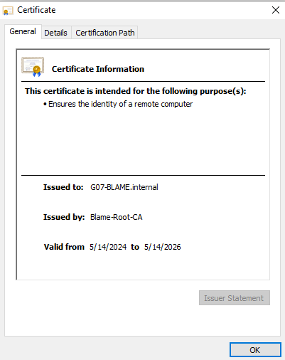

# Testplan: Uitbreiding: Certificate Authority

- Auteur(s) testplan: Matteo Alexander

**Opgelet**: de output kan verschillen in een echte opstelling, het gegeven "Verwacht resultaat" voor een test is slechts een placeholder voor een mogelijk geldige output. 


## Opstellen Omgeving

1) Zorg ervoor dat de Client, Windows server, db, web en rp vm's online zijn

2) Voer het CA script uit op de Windows server. Indien alles goed is verlopen runnt dit script zonder problemen
```bash
PS Z:\> ./CA.ps1
```

## Testen Certificate Authority

1) Probeer te surfen naar de wordpress site: https://g07-blame.internal

2) Indien alles goed verloopt zie je de pagina zonder security error


3) Zoals je ziet laat de site zonder error! Bekijk nu het certificaat door op het slotje links van de url te klikken


