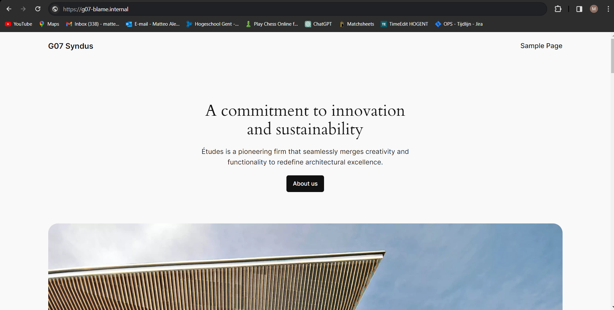

# Testplan: Nat Portforwarding/ACL's

- Auteur(s) testplan: Bert Coudenys

**Opgelet**: de output kan verschillen in een echte opstelling, het gegeven "Verwacht resultaat" voor een test is slechts een placeholder voor een mogelijk geldige output. Het apparaat waar de test op wordt uitgevoerd, staat telkens tussen haakjes in de titel van elke test/stap.

### Nat Portforwarding

1. Check de configuratie van beide routers voor de nat portforwarding settings
   Deze instellingen staan toe dat alle binnenkomende packeten naar IP:172.22.200.7 op poort 80 en 443, worden doorgestuurd naar de interne proxy.

```
ip forward-protocol nd
no ip http server
ip http authentication local
no ip http secure-server
ip tftp source-interface GigabitEthernet0
ip nat inside source static tcp 192.168.107.164 80 172.22.200.7 80 extendable
ip nat inside source static tcp 192.168.107.164 443 172.22.200.7 443 extendable
ip nat inside source list PUBLICIP interface GigabitEthernet0/0/0 overload
ip route 0.0.0.0 0.0.0.0 GigabitEthernet0/0/0
!
!
ip access-list standard PUBLICIP
 permit 192.168.107.0 0.0.0.255
 deny   any
```

2. Voer een externe test uit door vanuit een ander device vanop het publiek netwerk te surfen naar ons domain. Vanwege de hogent dns zal dit ge resolved worden naar ons public IP. Dit zou nu onze website moeten tonen zoals dit.
   

Dit toont aan dat de port forwarding instellingen correct werken!

### ACL's

De ACL's op dit netwerk zijn momenteel zoals dit ingesteld.

```
ip access-list extended NO-ACCESS-MANAGEMENT
 permit ip 192.168.107.128 0.0.0.15 any
 deny ip any any
!
ip access-list extended NO-ACCESS-INTERNAL-SERVER
 permit udp any any
 permit tcp any any established
 permit ip 192.168.107.0 0.0.0.127 any
 permit ip 192.168.107.160 0.0.0.7 any
 permit ip 192.168.107.144 0.0.0.15 any
 deny ip any any
!
ip access-list extended NO-ACCESS-INTERNAL-CLIENTS
 permit ip 192.168.107.0 0.0.0.127 any
 permit ip 192.168.107.160 0.0.0.7 any
 permit ip 192.168.107.144 0.0.0.15 any
 permit tcp any any established
 deny ip any any
!
!
ip access-list extended NO-ACCESS-PROXY
 permit ip 192.168.107.150 0.0.0.0 host 192.168.107.164
 permit tcp any any established
 permit tcp any any eq 443
 permit tcp any any eq www
 deny   ip any any
!
!
!
!
!
ipv6 access-list NO-ACCESS-MANAGEMENT-IPV6
 permit ipv6 2001:DB8:AC07:1::/64 any
!
ipv6 access-list NO-ACCESS-PROXY-IPV6
 permit ipv6 host 2001:db8:ac07:42::6 host 2001:db8:ac07:13::4
 permit tcp any any established
 permit tcp any any eq www
 permit tcp any any eq 443
!
ipv6 access-list NO-ACCESS-INTERNAL-SERVER-IPV6
 permit udp any any
 permit tcp any any established
 permit ipv6 2001:DB8:AC07:11::/64 any
 permit ipv6 2001:DB8:AC07:13::/64 any
 permit ipv6 2001:DB8:AC07:42::/64 any
!
ipv6 access-list NO-ACCESS-INTERNAL-CLIENTS-IPV6
 permit ipv6 2001:DB8:AC07:11::/64 any
 permit ipv6 2001:DB8:AC07:13::/64 any
 permit ipv6 2001:DB8:AC07:42::/64 any
 permit tcp any any established
```

En staan toegekend aan hun overeenkomende poorten als outbound.
Er is veel functionaliteid dat deze ACL's beperken.
Maar als test gaan wij een ping uitvoeren intern van de client naar de proxy.
Deze wordt tegengehouden aangezien de proxy enkel op poort 80 en 443 berijkbaar mag zijn.
Voor het gemak van demonstratie zullen al deze tests in packet tracer uitgevoerd worden.

Deze test held zowel voor extern als intern.

Ook gaan we testen of een client extern bereikbaar is vanaf de isp router.
Opniew zal deze falen, de clients zijn niet extern bereikbaar.


Connecties die verwacht worden te werken zijn wel nog steeds mogelijk. Het bereiken van zowel de dns, proxy, en windows server voor de client zijn niet belemerd door deze configuratie dit kan je testen door te surfen naar de website en u verwacht dit te zien.

