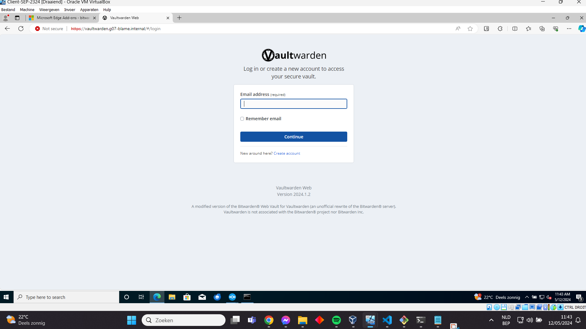
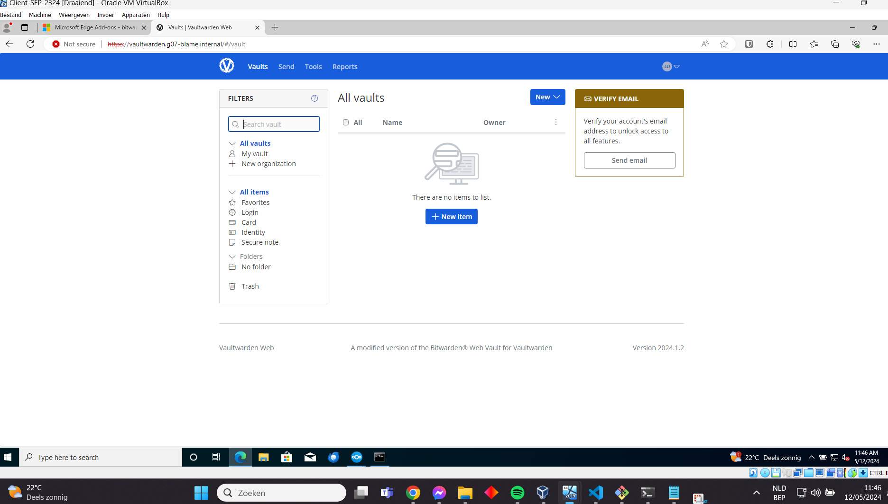
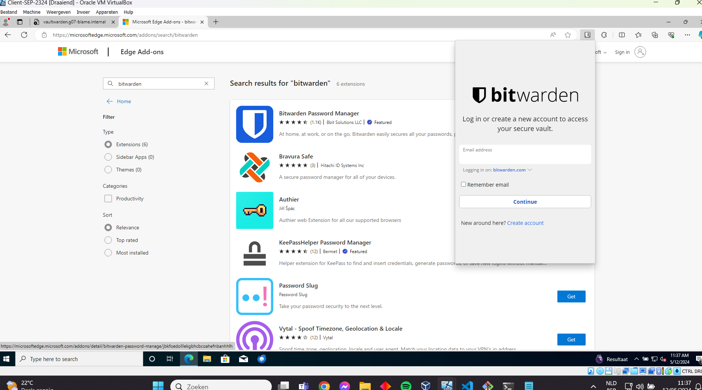
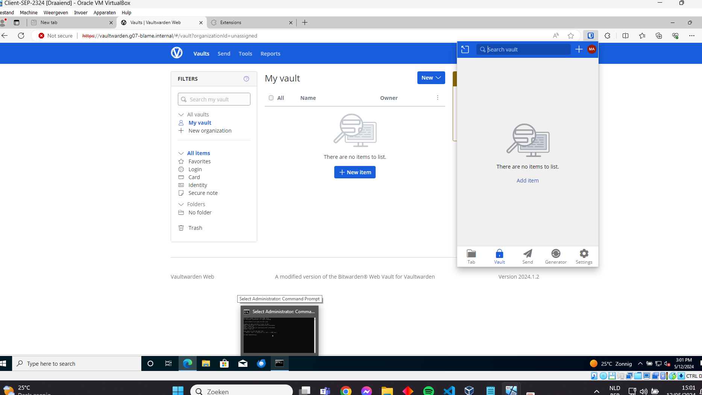
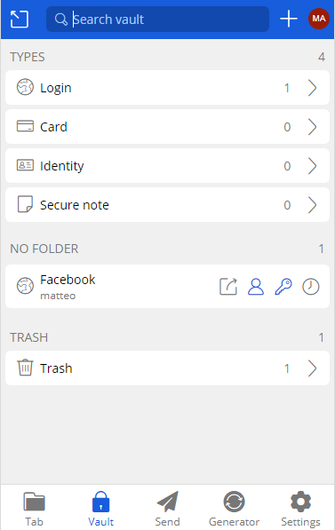
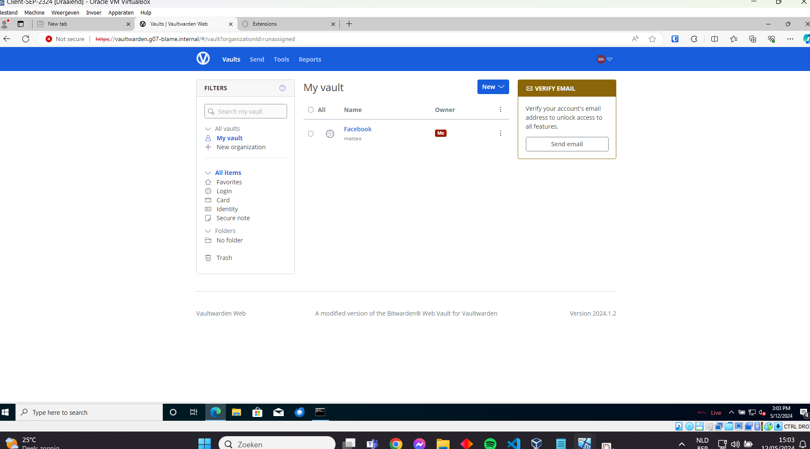

# Testplan: Uitbreiding: Vaultwarden/Bitwarden

- Auteur(s) testplan: Matteo Alexander

**Opgelet**: de output kan verschillen in een echte opstelling, het gegeven "Verwacht resultaat" voor een test is slechts een placeholder voor een mogelijk geldige output. 

##Opzetten omgeving

1) Zorg ervoor dat de db, extra, rp vm's draaien
```bash
PS C:\Users\matte\OneDrive\Documenten\HOgent\SEP\sep2324-gent-g07\opdrachten\Linux\Vagrant-VirtualeMachine> vagrant up db rp extra
```
```bash
PS C:\Users\matte\OneDrive\Documenten\HOgent\SEP\sep2324-gent-g07\opdrachten\Linux\Vagrant-VirtualeMachine> vagrant status  
Current machine states:

db                        running (virtualbox)
web                       poweroff (virtualbox)
rp                        running (virtualbox)
tftp                      not created (virtualbox)
extra                     running (virtualbox)

This environment represents multiple VMs. The VMs are all listed
above with their current state. For more information about a specific
VM, run `vagrant status NAME`.
```

##Testen werking Vaultwarden/Bitwarden

1) Open op de client de browser en surf naar: vaultwarden.g07-blame.internal. Normaal zou je deze pagina moeten zien verschijnen:




2) Login of maak een account aan. Normaal zou je op de homepagina moeten belanden.



3) Open nu extensies en zoek voor de nieuwe extensie "Bitwarden Password Manager". Installeer deze extensie en open het.



4) Onder de email sectie heb je: Logging in on. Kies bij deze optie Self-hosted en geef deze url in: vaultwarden.g07-blame.internal.

5) Log nu in met je reeds gemaakte account. Als alles goed gaat beland je op de pagina van daarnet, maar dan in het klein in de extensie.



6) Maak nu een nieuw item aan. bv: naam: Facebook, username: Matteo, ww: wachtwoord. Sla dit op.



7) Indien alles goed is verlopen kan je nu op de webpagina het nieuwe item zien verschijnen!

