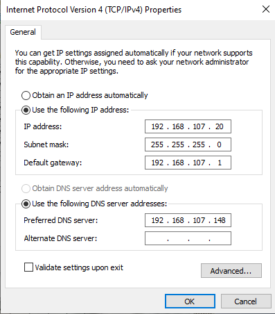
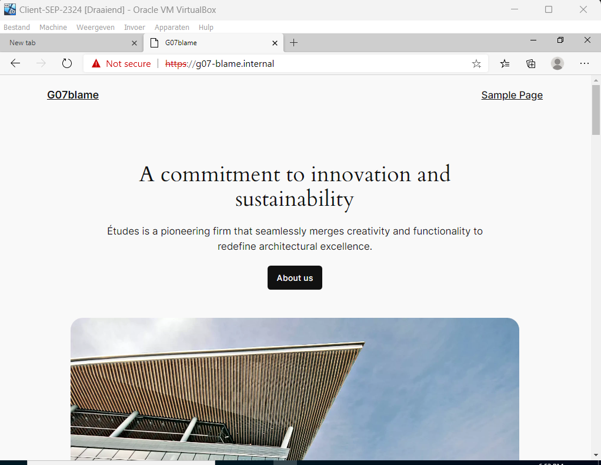

# Testplan: Windows Server

- Auteur(s) testplan: Matteo Alexander

**Opgelet**: de output kan verschillen in een echte opstelling, het gegeven "Verwacht resultaat" voor een test is slechts een placeholder voor een mogelijk geldige output. Het apparaat waar de test op wordt uitgevoerd, staat telkens tussen haakjes in de titel van elke test/stap.


## Aanmaken Virtuele machines

1) Voer het VM script uit op je pc door windows PowerShell als Administrator te openen en naar de juiste directory te gaan *(Hostmachine Windows Server VM)*

```
PS C:\Users\matte\OneDrive\Documenten\HOgent\SEP\windows server> ./VM 
```

Volg hierna de stappen in de terminal om de Virtuele machines automatisch aan te maken. Indien alles goed gaat starten deze machines nu ook automatisch op.

2) Zorg ervoor dat vanaf je VM online is deze opnieuw opgestart wordt zodat de shared folder in de bestanden verschijnt.

## Windows Server

1) Als je op de windows server VM zit ga dan naar de Command prompt door (Ctrl+alt+del) en maak daarna een nieuwe taak genaamd 'cmd' door op bestand (linksboven) te klikken.

2) Voer in de Command prompt deze commando's uit om powershell op te starten en het DC script te runnen *(Windows Server VM)*

```
C:\Windows\system32>powershell
Windows PowerShell
Copyright (C) Microsoft Corporation. All rights reserved.

Install the latest PowerShell for new features and improvements! https://aka.ms/PSWindows

PS C:\WINDOWS\system32> cd Z:\
PS Z:\> ./DC1
```

3) Indien alles goed is verlopen start de server nu vanzelf opnieuw op en zou je moeten zien dat het domein en de computernaam aangepast zijn.


4) Voer nu het DNS script uit op dezelfde manier als het DHCP script *(Windows Server VM)*

```
C:\Windows\system32>powershell
Windows PowerShell
Copyright (C) Microsoft Corporation. All rights reserved.

Install the latest PowerShell for new features and improvements! https://aka.ms/PSWindows

PS C:\WINDOWS\system32> cd Z:\
PS Z:\> ./DNS_Final.ps1
```

5) Na het uitvoeren van het script kan je de aanpassingen bekijken met behulp van dit command *(Windows Server VM)*

```
PS Z:\> Get-DnsServer
```

6) Nu kunnen we overgaan naar het testen of alle instellingen effectief wel werken. Controleer eerst of alle adapter settings van de windows server correct zijn geconfigureert.


Indien deze niet kloppen voer de volgende commands uit en run de beide scripts opnieuw *(Windows Server VM)*

```
PS C:\WINDOWS\system32> Set-NetIPAddress -InterfaceAlias Ethernet -IPAddress 192.168.107.148 -PrefixLength 24
PS C:\WINDOWS\system32> New-NetRoute -InterfaceAlias Ethernet -DestinationPrefix 0.0.0.0/0 -NextHop 192.168.107.1
PS C:\WINDOWS\system32> Set-DnsClientServerAddress -InterfaceAlias Ethernet -ServerAddresses 192.168.107.148
```

## Windows Client

1) Start nu de WinClient op en run het client script. *(Windows Client VM)*

```
PS Z:\> ./client
```

2) Check na het heropstarten van de client of alle adapter settings correct zijn


3) Indien alles juist werkt zou je nu in de browser moeten kunnen surfen naar onze beide websites




Laten we nu nog eens checken of alle wijzigingen correct zijn gebeurt en dat de RSAT-tools aanwezig zijn.

4) Kijk of de client in het domein zit *(Windows Server VM)*

```
C:\Users\Administrator>systeminfo | findstr /B /C:"Domain"
Domain:                    ad.g07-blame.internal
```

5) Check of alle benodigde RSAT-tools aanwezig zijn *(Windows Server VM)*

```
PS Z:\> Get-WindowsCapability -Name RSAT* -Online | Select-Object -Property DisplayName, State

DisplayName                                                                          State
-----------                                                                          -----
RSAT: Active Directory Domain Services and Lightweight Directory Services Tools  Installed
RSAT: BitLocker Drive Encryption Administration Utilities                       NotPresent
RSAT: Active Directory Certificate Services Tools                               NotPresent
RSAT: DHCP Server Tools                                                          Installed
RSAT: DNS Server Tools                                                           Installed
RSAT: Failover Clustering Tools                                                 NotPresent
RSAT: File Services Tools                                                       NotPresent
RSAT: Group Policy Management Tools                                              Installed
RSAT: IP Address Management (IPAM) Client                                       NotPresent
RSAT: Data Center Bridging LLDP Tools                                           NotPresent
RSAT: Network Controller Management Tools                                       NotPresent
RSAT: Network Load Balancing Tools                                              NotPresent
RSAT: Remote Access Management Tools                                            NotPresent
RSAT: Remote Desktop Services Tools                                              Installed
RSAT: Server Manager                                                             Installed
RSAT: Shielded VM Tools                                                         NotPresent
RSAT: Storage Migration Service Management Tools                                NotPresent
RSAT: Storage Replica Module for Windows PowerShell                             NotPresent
RSAT: System Insights Module for Windows PowerShell                             NotPresent
RSAT: Volume Activation Tools                                                   NotPresent
RSAT: Windows Server Update Services Tools                                      NotPresent
```

6) Probeer nu eens 1 van de RSAT tools te openen door op start te klikken en te scrollen naar Windows Administrative tools. Selecteer 1 van de tools (op foto DNS) en kijk of je de configuratie die op de windows server is gebeurt kan bekijken. *(Windows Server VM)*


7) Laten we nu eens inloggen als domain admin. Log jezelf uit en geef de inloggegevens in voor de domain admin (gebruikersnaam: emiel.l ww: Hogent2324). Bij de eerste keer inloggen zal je een nieuw wachtwoord moeten kiezen. Voor structuur en duidelijkheid in het project gebruiken we Emiel123. *(Windows Server VM)*


8) Als domain admin zouden we nu de mogelijkheid moeten hebben om de RSAT-tool Users & Computerste openen. Hier kan je bekijken hoe de groepindeling is van de gebruikers. *(Windows Server VM)*
   


9) Probeer nu eens de netwerk shares te bekijken. Ga naar file explorer en geef het volgend pad in: \\DC-SEP-2324. Normaal zou je dit scherm moeten zien en heb je toegang tot alle folders. *(Windows Server VM)*


10) Log nu eens in op een ander account (een guest of een user) en bekijk de shares opnieuw. Nu zou je enkel toegang mogen hebben tot de shares waar je zelf tot behoort. *(Windows Server VM)*


11) Probeer nu eens een nieuwe map aan te maken in je eigen share (lukt) en probeer dan eens in die van iemand anders in dezelfde groep (lukt niet). *(Windows Server VM)*


12) Als we nu weer inloggen op het domain admin account kunnen we eens de 'Group Policy Management' RSAT-tool openen. Hier kan je de GPO's bekijken. Wij hebben een GPO waar de Users en Guests geen rechten hebben om de powershell te openen. Dit kan je ook zien op onderstaande foto. *(Windows Server VM)*


13) Probeer nu als domain admin de powershell te openen. Normaal zou dit moeten lukken. *(Windows Server VM)*


14) Als we nu inloggen op een ander account (Client of User) zouden we de powershell niet mogen kunnen openen *(Windows Server VM)*

