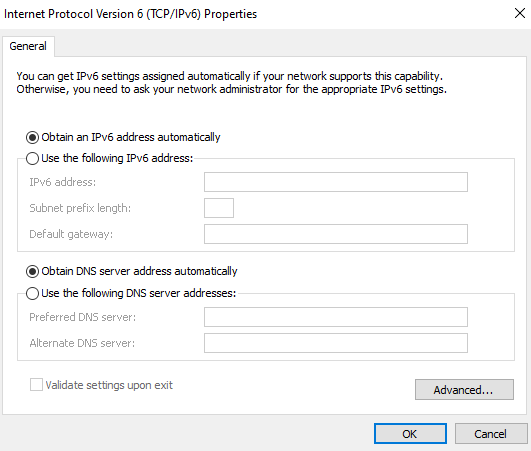

# Testplan: Ipv6 Netwerk

- Auteur(s) testplan: Bert Coudenys

**Opgelet**: de output kan verschillen in een echte opstelling, het gegeven "Verwacht resultaat" voor een test is slechts een placeholder voor een mogelijk geldige output. Het apparaat waar de test op wordt uitgevoerd, staat telkens tussen haakjes in de titel van elke test/stap.

## Netwerk ipv6

Het volledig interne netwerk is Ipv6 compliant, we kunnen dit testen door een interne ping te doen van de client naar de server.


## Windows ipv6

1) Zorg op de client dat ipv6 enabled is en op dhcp staat



2) Activeer de Windows Server zodat de dhcp server online is

3) Voer in de terminal op de client dit uit:
```bash
C:\Users\Administrator>ipconfig /renew

C:\Users\Administrator>ipconfig /renew

Windows IP Configuration


Ethernet adapter Ethernet:

   Connection-specific DNS Suffix  . : g07-blame.internal
   IPv6 Address. . . . . . . . . . . : 2001:db8:ac07:0:485b:262b:bdba:7bbf
   Temporary IPv6 Address. . . . . . : 2001:db8:ac07:0:f0c7:1fc5:2b34:3ddd
   Link-local IPv6 Address . . . . . : fe80::485b:262b:bdba:7bbf%12
   IPv4 Address. . . . . . . . . . . : 192.168.107.10
   Subnet Mask . . . . . . . . . . . : 255.255.255.0
   Default Gateway . . . . . . . . . : 192.168.107.1
```
Hier zie je mooi dat de client een nieuw ipv4/ipv6 adres heeft gekregen.
ipv4 = 192.168.107.10, ipv6 = 2001:db8:ac07:0:485b:262b:bdba:7bbf

4) Test of dit ook effectief werkt door vanop de Windows server het ipv6 adres te pingen
```bash
PS C:\Users\Administrator> ping 2001:db8:ac07:0:485b:262b:bdba:7bbf 

Pinging 2001:db8:ac07:0:485b:262b:bdba:7bbf with 32 bytes of data: 
Reply from 2001:db8:ac07:0:485b:262b:bdba:7bbf: time<1ms
Reply from 2001:db8:ac07:0:485b:262b:bdba:7bbf: time<1ms
Reply from 2001:db8:ac07:0:485b:262b:bdba:7bbf: time<1ms
Reply from 2001:db8:ac07:0:485b:262b:bdba:7bbf: time<1ms

Ping statistics for 2001:db8:ac07:0:485b:262b:bdba:7bbf: 
	Packets: Sent = 4, Received = 4, Lost = 0 (0 % loss), 
Approximate round trip times in milli-seconds: 
	Minimum = 0ms , Maximum = 0ms, Average = 0ms
```
5) Ping de wordpress site via ipv6 vanop de client
```bash
C:\Users\Administrator.G07-BLAME> ping -6 g07 - blame.internal 

Pinging g07-blame.internal [2001:db8:ac07:13::4] with 32 bytes of data: 
Reply from 2001:db8:ac07:13::4: time = 1ms 
Reply from 2001:db8:ac07:13::4: time = 1ms 
Reply from 2001:db8:ac07:13::4: time = 1ms 
Reply from 2001:db8:ac07:13::4: time = 1ms 

Ping statistics for 2001:db8:ac07:13::4: 
   Packets: Sent = 4, Received = 4 , Lost = 0 ( 0 % loss ), 
Approximate round trip times in milli-seconds: 
   Minimum = Oms , Maximum = 1ms , Average = Oms
```