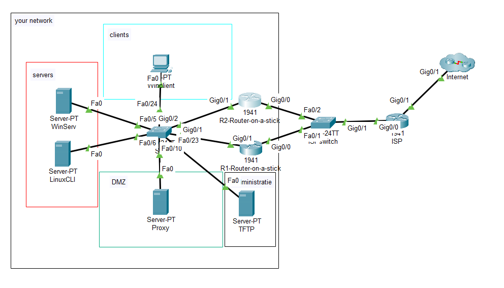
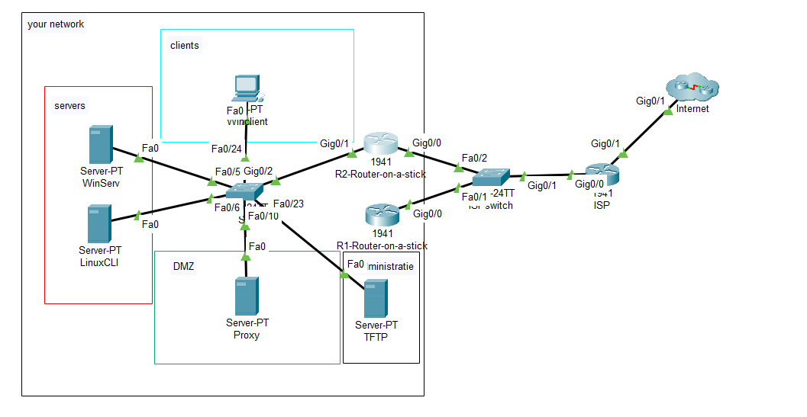

# Testplan: Netwerk Opstelling

- Auteur(s) testplan: Matteo Alexander

**Opgelet**: de output kan verschillen in een echte opstelling, het gegeven "Verwacht resultaat" voor een test is slechts een placeholder voor een mogelijk geldige output.

## Vlan Configuratie

1. Check op switch S1 of de vlan configuratie correct is

```bash
S1#show vlan brief

VLAN Name                             Status    Ports
---- -------------------------------- --------- -------------------------------
1    default                          active    Fa0/23
11   Workstations-Employees           active    Fa0/24
13   DMZ                              active    Fa0/10
42   Internal-Servers                 active    Fa0/1, Fa0/2, Fa0/3, Fa0/4
                                                Fa0/5, Fa0/6, Fa0/7, Fa0/8
                                                Fa0/9
99   Reserve                          active    Fa0/11, Fa0/12, Fa0/13, Fa0/14
                                                Fa0/15, Fa0/16, Fa0/17, Fa0/18
                                                Fa0/19, Fa0/20, Fa0/21, Fa0/22
1002 fddi-default                     active
1003 token-ring-default               active
1004 fddinet-default                  active
1005 trnet-default                    active
```

2. Check op de beide routers of vlan 1 geconfigureert is zodat de TFTP-server deze toestellen kan configureren

```bash
R1#show vlan brief

VLAN Name                             Status    Ports
---- -------------------------------- --------- -------------------------------
1    default                          active
1002 fddi-default                     active
1003 token-ring-default               active
1004 fddinet-default                  active
1005 trnet-default                    active
```

```bash
1    default                          active
1002 fddi-default                     active
1003 token-ring-default               active
1004 fddinet-default                  active
1005 trnet-default                    active
```

## Inter-vlan routing

1. Check of de subinterfaces correct zijn geconfigureert op beide routers
   R1:

```bash
R1#show running-config
interface GigabitEthernet0/1.1
 description Default gateway vlan1
 encapsulation dot1Q 1 native
 ip address 192.168.107.130 255.255.255.240
 ip access-group NO-ACCESS-MANAGEMENT out
 ipv6 traffic-filter NO-ACCESS-MANAGEMENT-IPV6 out
 ipv6 address 2001:DB8:AC07:1::1/64
 ipv6 address 2001:DB8:AC07:1::2/64
 standby 1 ip 192.168.107.129
 standby 1 priority 150
 standby 1 preempt
!
interface GigabitEthernet0/1.11
 description Default gateway vlan11
 encapsulation dot1Q 11
 ip address 192.168.107.2 255.255.255.128
 ip access-group NO-ACCESS-INTERNAL-CLIENTS out
 ipv6 traffic-filter NO-ACCESS-INTERNAL-CLIENTS-IPV6 out
 ipv6 address 2001:DB8:AC07:11::1/64
 ipv6 address 2001:DB8:AC07:11::2/64
 standby 1 ip 192.168.107.1
 standby 1 priority 150
 standby 1 preempt
!
interface GigabitEthernet0/1.13
 description Default gateway vlan13
 encapsulation dot1Q 13
 ip address 192.168.107.162 255.255.255.248
 ip access-group NO-ACCESS-PROXY out
 ipv6 traffic-filter NO-ACCESS-PROXY-IPV6 out
 ipv6 address 2001:DB8:AC07:13::1/64
 ipv6 address 2001:DB8:AC07:13::2/64
 standby 1 ip 192.168.107.161
 standby 1 priority 150
 standby 1 preempt
!
interface GigabitEthernet0/1.42
 description Default gateway vlan42
 encapsulation dot1Q 42
 ip address 192.168.107.146 255.255.255.240
 ip access-group NO-ACCESS-INTERNAL-SERVER out
 ipv6 traffic-filter NO-ACCESS-INTERNAL-SERVER-IPV6 out
 ipv6 address 2001:DB8:AC07:42::1/64
 ipv6 address 2001:DB8:AC07:42::2/64
 standby 1 ip 192.168.107.145
 standby 1 priority 150
 standby 1 preempt
```

R1#show ip route
Codes: L - local, C - connected, S - static, R - RIP, M - mobile, B - BGP
      D - EIGRP, EX - EIGRP external, O - OSPF, IA - OSPF inter area
      N1 - OSPF NSSA external type 1, N2 - OSPF NSSA external type 2
      E1 - OSPF external type 1, E2 - OSPF external type 2, E - EGP
      i - IS-IS, L1 - IS-IS level-1, L2 - IS-IS level-2, ia - IS-IS inter area
      * - candidate default, U - per-user static route, o - ODR
      P - periodic downloaded static route

Gateway of last resort is not set

    192.168.107.0/24 is variably subnetted, 10 subnets, 4 masks
C       192.168.107.0/25 is directly connected, GigabitEthernet0/1.11
L       192.168.107.2/32 is directly connected, GigabitEthernet0/1.11
C       192.168.107.128/28 is directly connected, GigabitEthernet0/1.1
L       192.168.107.130/32 is directly connected, GigabitEthernet0/1.1
C       192.168.107.144/28 is directly connected, GigabitEthernet0/1.42
L       192.168.107.146/32 is directly connected, GigabitEthernet0/1.42
C       192.168.107.160/29 is directly connected, GigabitEthernet0/1.13
L       192.168.107.162/32 is directly connected, GigabitEthernet0/1.13
C       192.168.107.248/29 is directly connected, GigabitEthernet0/0
L       192.168.107.250/32 is directly connected, GigabitEthernet0/0
```

R2:

```bash
interface GigabitEthernet0/1.1
description Default gateway vlan1
encapsulation dot1Q 1 native
ip address 192.168.107.131 255.255.255.240
ip access-group NO-ACCESS-MANAGEMENT out
ipv6 traffic-filter NO-ACCESS-MANAGEMENT-IPV6 out
ipv6 address 2001:DB8:AC07:1::3/64
standby 1 ip 192.168.107.129
!
interface GigabitEthernet0/1.11
description Default gateway vlan11
encapsulation dot1Q 11
ip address 192.168.107.3 255.255.255.128
ip access-group NO-ACCESS-INTERNAL-CLIENTS out
ipv6 traffic-filter NO-ACCESS-INTERNAL-CLIENTS-IPV6 out
ipv6 address 2001:DB8:AC07:11::3/64
standby 1 ip 192.168.107.1
!
interface GigabitEthernet0/1.13
description Default gateway vlan13
encapsulation dot1Q 13
ip address 192.168.107.163 255.255.255.248
ip access-group NO-ACCESS-PROXY out
ipv6 traffic-filter NO-ACCESS-PROXY-IPV6 out
ipv6 address 2001:DB8:AC07:13::3/64
standby 1 ip 192.168.107.161
!
interface GigabitEthernet0/1.42
description Default gateway vlan42
encapsulation dot1Q 42
ip address 192.168.107.147 255.255.255.240
ip access-group NO-ACCESS-INTERNAL-SERVER out
ipv6 traffic-filter NO-ACCESS-INTERNAL-SERVER-IPV6 out
ipv6 address 2001:DB8:AC07:42::3/64
standby 1 ip 192.168.107.145
```

```bash
R2#show ip route
Codes: L - local, C - connected, S - static, R - RIP, M - mobile, B - BGP
       D - EIGRP, EX - EIGRP external, O - OSPF, IA - OSPF inter area
       N1 - OSPF NSSA external type 1, N2 - OSPF NSSA external type 2
       E1 - OSPF external type 1, E2 - OSPF external type 2, E - EGP
       i - IS-IS, L1 - IS-IS level-1, L2 - IS-IS level-2, ia - IS-IS inter area
       * - candidate default, U - per-user static route, o - ODR
       P - periodic downloaded static route

Gateway of last resort is not set

     192.168.107.0/24 is variably subnetted, 10 subnets, 4 masks
C       192.168.107.0/25 is directly connected, GigabitEthernet0/1.11
L       192.168.107.3/32 is directly connected, GigabitEthernet0/1.11
C       192.168.107.128/28 is directly connected, GigabitEthernet0/1.1
L       192.168.107.131/32 is directly connected, GigabitEthernet0/1.1
C       192.168.107.144/28 is directly connected, GigabitEthernet0/1.42
L       192.168.107.147/32 is directly connected, GigabitEthernet0/1.42
C       192.168.107.160/29 is directly connected, GigabitEthernet0/1.13
L       192.168.107.163/32 is directly connected, GigabitEthernet0/1.13
C       192.168.107.248/29 is directly connected, GigabitEthernet0/0
L       192.168.107.251/32 is directly connected, GigabitEthernet0/0
```

## Ping test

1. Ping vanaf de Windows Server de Linux Server en omgekeerd (allebei in vlan 42)

```bash
C:\>ping 192.168.107.150

Pinging 192.168.107.150 with 32 bytes of data:

Reply from 192.168.107.150: bytes=32 time<1ms TTL=128
Reply from 192.168.107.150: bytes=32 time<1ms TTL=128
Reply from 192.168.107.150: bytes=32 time<1ms TTL=128
Reply from 192.168.107.150: bytes=32 time<1ms TTL=128

Ping statistics for 192.168.107.150:
    Packets: Sent = 4, Received = 4, Lost = 0 (0% loss),
Approximate round trip times in milli-seconds:
    Minimum = 0ms, Maximum = 0ms, Average = 0ms
```

```bash
C:\>ping 192.168.107.148

Pinging 192.168.107.148 with 32 bytes of data:

Reply from 192.168.107.148: bytes=32 time<1ms TTL=128
Reply from 192.168.107.148: bytes=32 time<1ms TTL=128
Reply from 192.168.107.148: bytes=32 time<1ms TTL=128
Reply from 192.168.107.148: bytes=32 time<1ms TTL=128

Ping statistics for 192.168.107.148:
    Packets: Sent = 4, Received = 4, Lost = 0 (0% loss),
Approximate round trip times in milli-seconds:
    Minimum = 0ms, Maximum = 0ms, Average = 0ms
```

2. Ping vanaf de Windows Server naar de Reverse proxy en omgekeerd (Inter-vlan)

```bash
C:\>ping 192.168.107.164

Pinging 192.168.107.164 with 32 bytes of data:

Reply from 192.168.107.164: bytes=32 time<1ms TTL=127
Reply from 192.168.107.164: bytes=32 time<1ms TTL=127
Reply from 192.168.107.164: bytes=32 time<1ms TTL=127
Reply from 192.168.107.164: bytes=32 time<1ms TTL=127

Ping statistics for 192.168.107.164:
    Packets: Sent = 4, Received = 4, Lost = 0 (0% loss),
Approximate round trip times in milli-seconds:
    Minimum = 0ms, Maximum = 0ms, Average = 0ms
```

C:\>ping 192.168.107.148

Pinging 192.168.107.148 with 32 bytes of data:

Reply from 192.168.107.148: bytes=32 time<1ms TTL=127
Reply from 192.168.107.148: bytes=32 time<1ms TTL=127
Reply from 192.168.107.148: bytes=32 time<1ms TTL=127
Reply from 192.168.107.148: bytes=32 time<1ms TTL=127

Ping statistics for 192.168.107.148:
    Packets: Sent = 4, Received = 4, Lost = 0 (0% loss),
Approximate round trip times in milli-seconds:
    Minimum = 0ms, Maximum = 0ms, Average = 0ms
```

3. Ping vanaf de Windows Server de ISP router

```bash
C:\>ping 192.168.107.254

Pinging 192.168.107.254 with 32 bytes of data:

Reply from 192.168.107.254: bytes=32 time<1ms TTL=254
Reply from 192.168.107.254: bytes=32 time=3ms TTL=254
Reply from 192.168.107.254: bytes=32 time<1ms TTL=254
Reply from 192.168.107.254: bytes=32 time<1ms TTL=254

Ping statistics for 192.168.107.254:
    Packets: Sent = 4, Received = 4, Lost = 0 (0% loss),
Approximate round trip times in milli-seconds:
    Minimum = 0ms, Maximum = 3ms, Average = 0ms
```

## Werking HSRP

1. Laten we testen of de configuratie van HSRP werkt. Dit is onze opstelling momenteel:



Als we nu kijken op de R1 kunnen we zien dat deze actief is

```bash
R1#show standby brief
                     P indicates configured to preempt.
                     |
Interface   Grp  Pri P State    Active          Standby         Virtual IP
Gig         1    150 P Active   local           192.168.107.131 192.168.107.129
Gig         1    150 P Active   local           192.168.107.3   192.168.107.1
Gig         1    150 P Active   local           192.168.107.163 192.168.107.161
Gig         1    150 P Active   local           192.168.107.147 192.168.107.145
```

Op R2 zien we momenteel dat deze op standby staat

```bash
R2#show standby brief
                     P indicates configured to preempt.
                     |
Interface   Grp  Pri P State    Active          Standby         Virtual IP
Gig         1    100   Standby  192.168.107.130 local           192.168.107.129
Gig         1    100   Standby  192.168.107.2   local           192.168.107.1
Gig         1    100   Standby  192.168.107.162 local           192.168.107.161
Gig         1    100   Standby  192.168.107.146 local           192.168.107.145
Doormiddel van dit command kan je nu zien bij status dat R2 actief is.
```

2. Verwijder nu eens de kabel tussen switch S1 en router R1



Als HSRP goed is geconfigureert zou router R2 zijn status actief moeten zijn

R2#show standby brief
                     P indicates configured to preempt.
                     |
Interface   Grp  Pri P State    Active          Standby         Virtual IP
Gig         1    100   Active   local           unknown         192.168.107.129
Gig         1    100   Active   local           unknown         192.168.107.1
Gig         1    100   Active   local           unknown         192.168.107.161
Gig         1    100   Active   local           unknown         192.168.107.145
```

3. Probeer nu eens te pingen van de Windows Server naar de Reverse Proxy server. Normaal gezien zou de ping nog steeds moeten lukken.

```bash
C:\>ping 192.168.107.164

Pinging 192.168.107.164 with 32 bytes of data:

Reply from 192.168.107.164: bytes=32 time<1ms TTL=127
Reply from 192.168.107.164: bytes=32 time<1ms TTL=127
Reply from 192.168.107.164: bytes=32 time<1ms TTL=127
Reply from 192.168.107.164: bytes=32 time<1ms TTL=127

Ping statistics for 192.168.107.164:
    Packets: Sent = 4, Received = 4, Lost = 0 (0% loss),
Approximate round trip times in milli-seconds:
    Minimum = 0ms, Maximum = 0ms, Average = 0ms
```