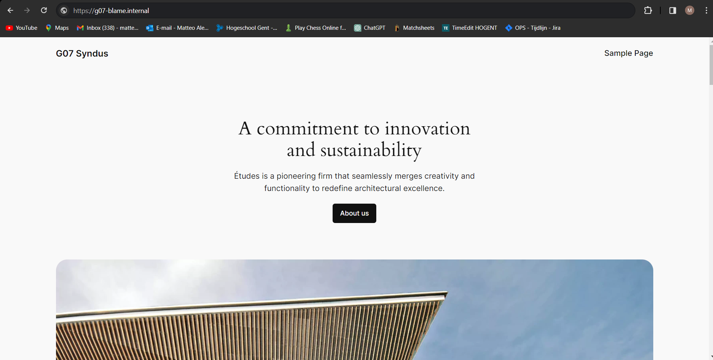

# Testplan: Linux webserver

- Auteur(s) testplan: Matteo Alexander

**Opgelet**: de output kan verschillen in een echte opstelling, het gegeven "Verwacht resultaat" voor een test is slechts een placeholder voor een mogelijk geldige output. Het apparaat waar de test op wordt uitgevoerd, staat telkens tussen haakjes in de titel van elke test/stap.

1) Ga naar de juiste directory *(Hostmachine webserver-VM)*

```
C:\Users\matte\OneDrive\Documenten\HOgent\SEP\sep2324-gent-g07> cd .\opdrachten\Linux\Vagrant-VirtualeMachine\
```

2) Start de Webserver vm op *(Hostmachine webserver-VM)*

```
C:\Users\matte\OneDrive\Documenten\HOgent\SEP\sep2324-gent-g07\opdrachten\Linux\Vagrant-VirtualeMachine> vagrant up web
```

3) Log in op de vm *(Hostmachine webserver-VM)*

```
C:\Users\matte\OneDrive\Documenten\HOgent\SEP\sep2324-gent-g07\opdrachten\Linux\Vagrant-VirtualeMachine> vagrant ssh web
```

4) Check of SELinux actief is *(Webserver-VM)*

```
[vagrant@web ~]$ getenforce
Enforcing
```

5) Bekijk de netwerkinstellingen *(Webserver-VM)*

```
[vagrant@web ~]$ ip a
1: lo: <LOOPBACK,UP,LOWER_UP> mtu 65536 qdisc noqueue state UNKNOWN group default qlen 1000
    link/loopback 00:00:00:00:00:00 brd 00:00:00:00:00:00
    inet 127.0.0.1/8 scope host lo
       valid_lft forever preferred_lft forever
    inet6 ::1/128 scope host 
       valid_lft forever preferred_lft forever
2: eth0: <BROADCAST,MULTICAST,UP,LOWER_UP> mtu 1500 qdisc fq_codel state UP group default qlen 1000
    link/ether 08:00:27:7b:6a:36 brd ff:ff:ff:ff:ff:ff
    altname enp0s3
    inet 10.0.2.15/24 brd 10.0.2.255 scope global dynamic noprefixroute eth0
       valid_lft 74981sec preferred_lft 74981sec
    inet6 fe80::cc18:b378:32d0:8d67/64 scope link noprefixroute
       valid_lft forever preferred_lft forever
3: eth1: <BROADCAST,MULTICAST,UP,LOWER_UP> mtu 1500 qdisc fq_codel state UP group default qlen 1000
    link/ether 08:00:27:13:68:8d brd ff:ff:ff:ff:ff:ff
    altname enp0s8
    inet 192.168.1.7/24 brd 192.168.1.255 scope global noprefixroute eth1
       valid_lft forever preferred_lft forever
    inet6 fe80::a00:27ff:fe13:688d/64 scope link
       valid_lft forever preferred_lft forever
```

Zorg dat het ip address van eth1 overeenkomt met het static ip adres in common.sh voor STATIC_IP_WEB

6) Test of je de databankserver kan pingen *(Webserver-VM)*

```
[vagrant@web ~]$ ping 192.168.1.8
PING 192.168.1.8 (192.168.1.8) 56(84) bytes of data.
64 bytes from 192.168.1.8: icmp_seq=1 ttl=64 time=0.311 ms
64 bytes from 192.168.1.8: icmp_seq=2 ttl=64 time=0.343 ms
64 bytes from 192.168.1.8: icmp_seq=3 ttl=64 time=0.281 ms
64 bytes from 192.168.1.8: icmp_seq=4 ttl=64 time=0.312 ms
^C
--- 192.168.1.8 ping statistics ---
4 packets transmitted, 4 received, 0% packet loss, time 3073ms
rtt min/avg/max/mdev = 0.281/0.311/0.343/0.021 ms
```

7) Controleer of de Apache-service actief is *(Webserver-VM)*

```
[vagrant@web ~]$ sudo systemctl status httpd
● httpd.service - The Apache HTTP Server
     Loaded: loaded (/usr/lib/systemd/system/httpd.service; enabled; preset: disabled)
    Drop-In: /usr/lib/systemd/system/httpd.service.d
             └─php-fpm.conf
     Active: active (running) since Sun 2024-03-17 13:41:12 UTC; 3h 14min ago
       Docs: man:httpd.service(8)
   Main PID: 6580 (httpd)
     Status: "Total requests: 31; Idle/Busy workers 100/0;Requests/sec: 0.00266; Bytes served/sec: 213 B/sec"
      Tasks: 278 (limit: 11147)
     Memory: 36.8M
        CPU: 8.170s
     CGroup: /system.slice/httpd.service
             ├─6580 /usr/sbin/httpd -DFOREGROUND
             ├─6581 /usr/sbin/httpd -DFOREGROUND
lines 1-14
```

8) Bekijk de firewall instellingen *(Webserver-VM)*

```
[vagrant@web ~]$ sudo firewall-cmd --list-all
public (active)
  target: default
  icmp-block-inversion: no
  interfaces: eth0 eth1
  sources:
  services: cockpit dhcpv6-client ssh
  ports:
  protocols:
  forward: yes
  masquerade: no
  forward-ports:
  source-ports:
  icmp-blocks:
  rich rules:
        rule family="ipv4" source address="192.168.1.9" port port="80" protocol="tcp" accept
```

9) Controlleer de WordPress configuratie *(Webserver-VM)*

```
[vagrant@web ~]$ sudo cat /var/www/html/wordpress/wp-config.php
<?php
define( 'DB_NAME', 'wordpress_db' );
define( 'DB_USER', 'wordpress_user' );
define( 'DB_PASSWORD', 'Kof3Cup.ByRu' );
define( 'DB_HOST', '192.168.1.8' );
define( 'DB_CHARSET', 'utf8mb4' );
define( 'DB_COLLATE', '' );

$table_prefix = 'wp_';
define( 'WP_DEBUG', false );
if ( ! defined( 'ABSPATH' ) ) {
    define( 'ABSPATH', __DIR__ . '/' );
}
# Controleer of de array-sleutel bestaat voordat je deze gebruikt http_forwarder
if (isset($_SERVER['HTTP_X_FORWARDED_PROTO']) && $_SERVER['HTTP_X_FORWARDED_PROTO'] == 'https') {
    $_SERVER['HTTPS'] = 'on';
}
#controleer of de array sleutel bestaat voordat je deze gebruikt httpost
if (isset($_SERVER['HTTP_HOST'])) {
    $http_host = $_SERVER['HTTP_HOST'];
} else {
    // Set a default value or handle the case when HTTP_HOST is not set
    $http_host = 'your_default_host';
}
require_once ABSPATH . 'wp-settings.php';
```

10) Controleer Apache-beveiligingsinstellingen *(Webserver-VM)*

```
[vagrant@web ~]$ sudo cat /etc/httpd/conf/httpd.conf | grep -E "ServerTokens|ServerSignature"
ServerTokens Prod
ServerSignature Off
```
11) Surf naar "g07-blame.internal" je zou onze website moeten zien verschijnen *(Client-VM)*

