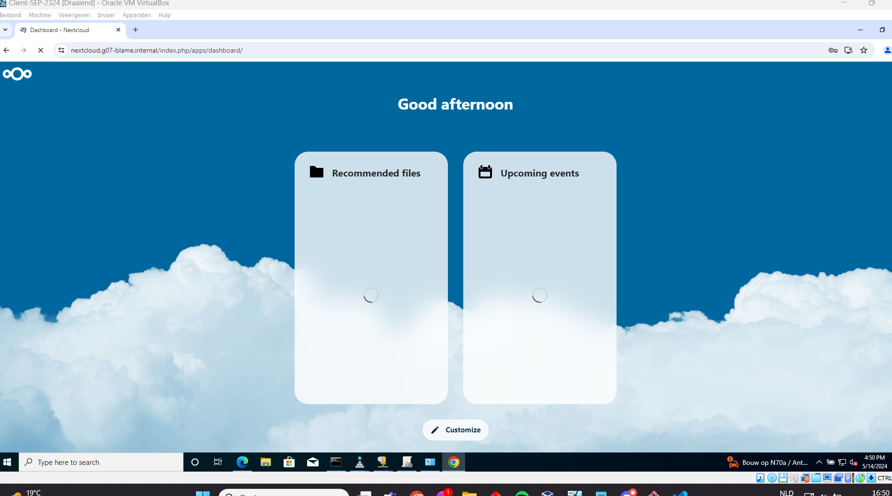
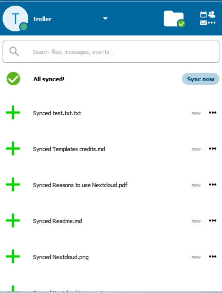
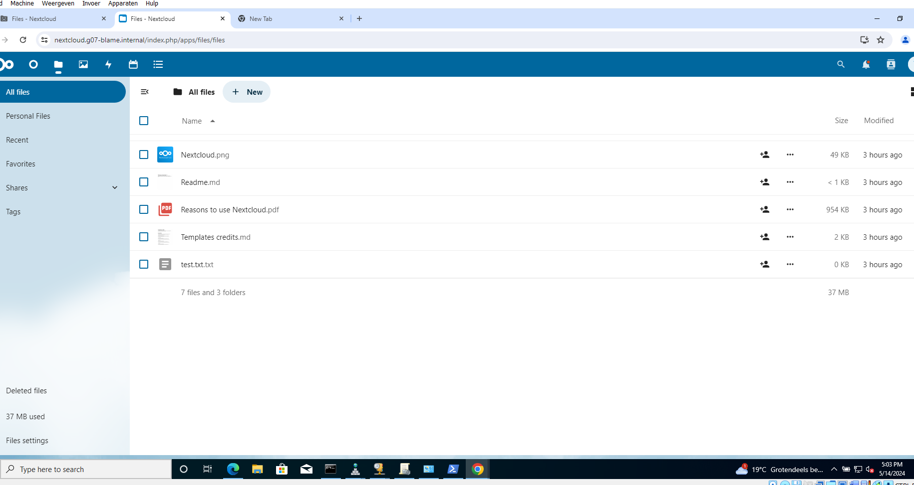

# Testrapport: Uitbreiding: NextCloud

- Auteur(s) respectievelijke testplan: Matteo Alexander
- Uitvoerder(s) test: Lucas Ludueña-Segre
- Uitgevoerd op: 14/05/2024

## Test: Uitbreiding: NextCloud

Test procedure:

- Opzetten omgeving

    1. Zorg ervoor dat de db, rp, extra vm's up zijn

    2. Ga naar de Z schijf en run het client.ps1 bestand. Hierdoor zullen Thunderbird en Nextcloud geïnstalleerd worden. (CLIENT)

- Testen werking Nextcloud

    1. Ga nu naar de browser en surf naar: https://nextcloud.g07-blame.internal/    (CLIENT)

    2. Normaal moet je nu de login pagina zien verschijnen. Log in met de volgende gegevens: Gebruikersnaam = troller & ww = gekuntdepotopmetwindows

    3. Indien alles goed is verlopen wordt je nu ingelogd op Nextcloud en zie je het dashboard. (het laden kan zeer lang duren)

    4. Open nu de nextcloud applicatie die automatisch is installed door het client script. Kies voor login en geef de volgende url in: https://nextcloud.g07-blame.internal/. Trust het gegeven certificaat en indien alles goed gaat zal nextcloud in de browser worden geopend en zal er gevraagd worden voor toestemming om het account te koppelen. Indien gelukt verschijnt het dashboard in een kleine applicatie in de rechterhoek van je scherm, hier heb je ook direct de optie om de bestanden in de app en cloud te synchronizeren.

    5. Klik op het bestanden icoontje in de app en maak een nieuw bestand aan (bv: test2.txt). Eerst zal er een blauw logo links van dit bestand staan, dit wijst erop dat het bestand gesynchronizeert wordt met de cloud. Als er een groen vinkje staat is het synchronizeren gelukt.

    6. Open nu nextcloud in de browser en surf naar de bestanden. Indien alles goed verlopen is kan je nu het test2.txt bestand zien.

- Connectie met Thunderbird

    1. Open de Thunderbird applicatie die automatisch is installed door het client script. Maak een account aan of log in met een bestaand account (maakt niet uit welk account). Klik op agenda, normaal zou je dit moeten zien:

    2. Klik linksonder op "nieuwe agenda" en kies voor de optie "Op het netwerk". Voor de gebruikersnaam geef je nu "Troller" in. Bij de URL is het iets complexer. De volgende stappen zullen gedetailleerd uitleggen hoe je de url kunt bekomen:

    - Verkrijgen URL:

        1. Open nextcloud in de browser en klik op het agenda icoontje. Hier zal je de automatisch aangemaakte "Plopkoek" agenda vinden.
        Dit is de agenda die we zullen synchronizeren met Thunderbird.

        2. Klik op "agenda instellingen" en kies voor de optie: Kopieer primair CalDAV adres. Nu zal de URL zich in je klembord bevinden. 
        Deze zal er als volgt uitzien: https://nextcloud.g07-blame.internal/remote.php/dav. Plak dit in de Thunderbird applicatie bij URL.

        3. Klik op agenda's zoeken en indien alles goed verloopt zal je nu het wahtwoord voor nextcloud moeten ingeven: "gekuntdepotopmetwindows". 
        Nu zal de plopkoek agenda verschijnen. Die selecteer je en klik daarna op abboneren. Indien alles goed is verlopen zijn deze nu gesynchronizeert. 

        4. Maak nu in Thunderbird een nieuwe gebeurtenis aan op de kalender en kijk of je deze op nextcloud ziet verschijnen.

- Aanmaken/invullen form

    1. Opgelet! Zorg ervoor dat je voor deze stap op een Bridged network werkt. Anders zal je eigen pc niet aan de form kunnen!

    2. Update indien op windows de windows hostfile en voeg dit lijntje toe:

    3. Ga op je Client naar nextcloud en open de form tab

    4. Indien er nog geen form is maak er één aan en voeg de vragen die je wenst toe. Als er wel al een form is selecteer deze en klik op delen.

    5. Kopieer de link naar je klembord en open deze op je eigen pc in de browser. Indien alles goed werkt kan je nu de gemaakte form invullen en indienen.

    6. Om te controleren kan je nu op de client op resultaten klikken en zal je zien dat er een nieuw resultaat is bijgekomen.

    7. Gefeliciteerd, de Nextcloud uitbreiding is afgewerkt!

Verkregen resultaat:

- Opzetten omgeving

    1. Zorg ervoor dat de db, rp, extra vm's up zijn

    (De database en reverse proxy draaien op de andere laptops, vandaar dat enkel de extra webserver hier draait)

    ```
    lucas@Findux:~/sep2324-gent-g07/opdrachten/Linux/Vagrant-VirtualeMachine$ vagrant status
    Current machine states:

    db                        not created (virtualbox)
    web                       not created (virtualbox)
    rp                        not created (virtualbox)
    tftp                      not created (virtualbox)
    extra                     running (virtualbox)
    rp-tf                     not created (virtualbox)

    This environment represents multiple VMs. The VMs are all listed
    above with their current state. For more information about a specific
    VM, run `vagrant status NAME`.
    ```

    2. Ga naar de Z schijf en run het client.ps1 bestand. Hierdoor zullen Thunderbird en Nextcloud geïnstalleerd worden. (CLIENT)
    ```
    C:\Users\Administrator> cd Z:\
    Z:\> .\client.ps1
    ```

- Testen werking Nextcloud

    1. Ga nu naar de browser en surf naar: https://nextcloud.g07-blame.internal/    (CLIENT)

    2. Normaal moet je nu de login pagina zien verschijnen. Log in met de volgende gegevens: Gebruikersnaam = troller & ww = gekuntdepotopmetwindows

    3. Indien alles goed is verlopen wordt je nu ingelogd op Nextcloud en zie je het dashboard. (het laden kan zeer lang duren)

    

    4. Open nu de nextcloud applicatie die automatisch is installed door het client script. Kies voor login en geef de volgende url in: https://nextcloud.g07-blame.internal/. Trust het gegeven certificaat en indien alles goed gaat zal nextcloud in de browser worden geopend en zal er gevraagd worden voor toestemming om het account te koppelen. Indien gelukt verschijnt het dashboard in een kleine applicatie in de rechterhoek van je scherm, hier heb je ook direct de optie om de bestanden in de app en cloud te synchronizeren.

    

    5. Klik op het bestanden icoontje in de app en maak een nieuw bestand aan (bv: test.txt.txt). Eerst zal er een blauw logo links van dit bestand staan, dit wijst erop dat het bestand gesynchronizeert wordt met de cloud. Als er een groen vinkje staat is het synchronizeren gelukt.

    6. Open nu nextcloud in de browser en surf naar de bestanden. Indien alles goed verlopen is kan je nu het test.txt.txt bestand zien.

    

- Connectie met Thunderbird

    1. Open de Thunderbird applicatie die automatisch is installed door het client script. Maak een account aan of log in met een bestaand account (maakt niet uit welk account).

    Tijdens deze stap is de kalender-app door een onbekende reden vastgelopen. De verbinding met de Nextcloud-server was er nog steeds, maar de snelheid was zo traag dat ik de test niet kon verderzetten.

Test geslaagd:

- [ ] Ja
- [x] Nee

Opmerkingen:

- De teststappen via de browser verliepen via een aparte laptop, aangezien op mijn laptop maar één netwerkadapter is die enkel met één VLAN kan verbinden.