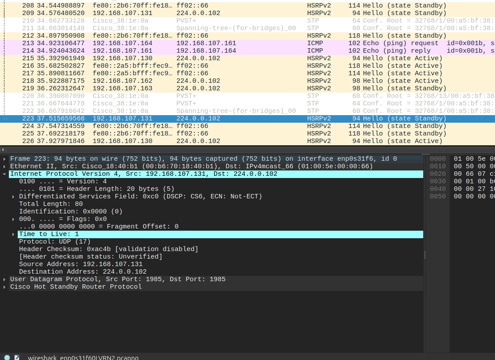
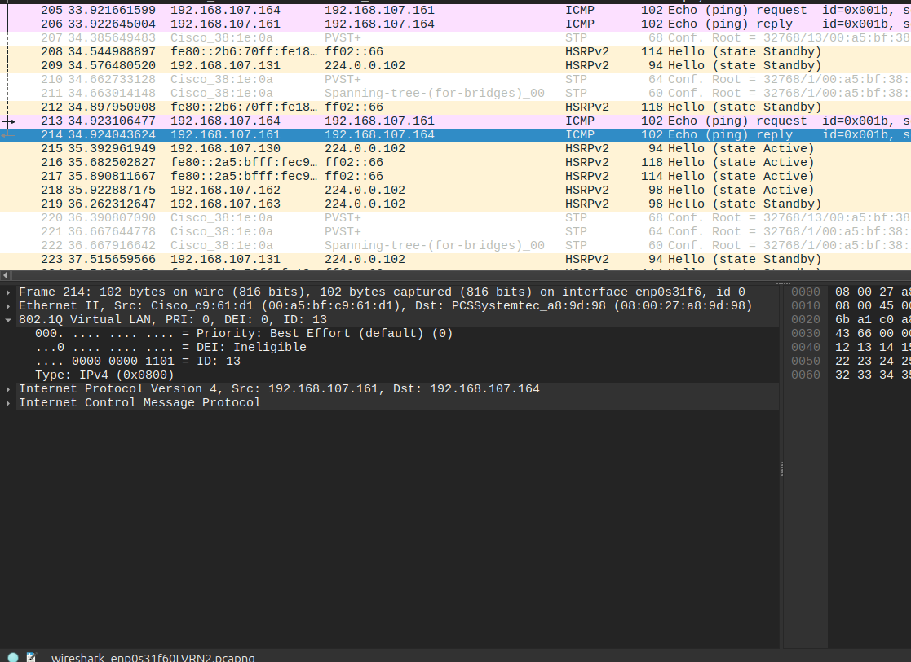

# Testrapport: Bridge TFTP  met Reverse proxy

-Auteur(s): Arthur Van Ginderachter


1) Log in op de Bridged TFTP vm 


-> vagrant ssh rp-tf
Test geslaagd:
- [x] ja 
- [ ] nee
- 
2) ping vanop de bridged vm naar de router in vlan 1

```bash
--- 192.168.107.1 ping statistics ---                                                        │[vagrant@rp-tf ~]$ ls
33 packets transmitted, 33 received, 0% packet loss, time 32482ms                            │[vagrant@rp-tf ~]$ ls
rtt min/avg/max/mdev = 0.860/1.432/3.540/0.447 ms                                            │[vagrant@rp-tf ~]$ ls
[root@rp-tf nginx]# ping 192.168.107.133                                                     │[vagrant@rp-tf ~]$ ls
PING 192.168.107.133 (192.168.107.133) 56(84) bytes of data.                                 │[vagrant@rp-tf ~]$ ls
64 bytes from 192.168.107.133: icmp_seq=1 ttl=64 time=0.061 ms                               │[vagrant@rp-tf ~]$ ls
64 bytes from 192.168.107.133: icmp_seq=2 ttl=64 time=0.111 ms                               │[vagrant@rp-tf ~]$ ^C
64 bytes from 192.168.107.133: icmp_seq=3 ttl=64 time=0.113 ms                               │[vagrant@rp-tf ~]$ 
64 bytes from 192.168.107.133: icmp_seq=4 ttl=64 time=0.110 ms                               ├────────────────────────────────────────────────────────────────────────────────────────────────
64 bytes from 192.168.107.133: icmp_seq=5 ttl=64 time=0.137 ms                               │13:54:08.134974 IP 192.168.107.162.hsrp > 224.0.0.102.hsrp: HSRPv1
64 bytes from 192.168.107.133: icmp_seq=6 ttl=64 time=0.072 ms                               │13:54:08.733856 IP 192.168.107.163.hsrp > 224.0.0.102.hsrp: HSRPv2
64 bytes from 192.168.107.133: icmp_seq=7 ttl=64 time=0.159 ms                               │13:54:08.734039 IP6 fe80::2b6:70ff:fe18:40b1.hsrpv6 > ff02::66.hsrpv6: UDP, length 6
64 bytes from 192.168.107.133: icmp_seq=8 ttl=64 time=0.074 ms                               │13:54:08.873804 STP 802.1d, Config, Flags [none], bridge-id 800d.00:a5:bf:38:1e:00.800a, length 
^C                                                                                           │42
--- 192.168.107.133 ping statistics ---                                                      │13:54:09.167390 IP6 fe80::2b6:70ff:fe18:40b1.hsrpv6 > ff02::66.hsrpv6: UDP, length 52
8 packets transmitted, 8 received, 0% packet loss, time 7233ms                               │13:54:10.308694 IP 192.168.107.163.hsrp > 224.0.0.102.hsrp: HSRPv1
```
Test geslaagd:
- [x] ja 
- [ ] nee


3) ping vanop de bridged vm naar de router in vlan 13
```bash
[root@rp-tf nginx]# ping 192.168.107.161                                                     │13:54:10.879179 STP 802.1d, Config, Flags [none], bridge-id 800d.00:a5:bf:38:1e:00.800a, length 
PING 192.168.107.161 (192.168.107.161) 56(84) bytes of data.                                 │42
64 bytes from 192.168.107.161: icmp_seq=1 ttl=255 time=0.833 ms                              │13:54:11.093976 IP 192.168.107.162.hsrp > 224.0.0.102.hsrp: HSRPv1
64 bytes from 192.168.107.161: icmp_seq=2 ttl=255 time=1.80 ms                               │13:54:12.029304 IP6 fe80::2b6:70ff:fe18:40b1.hsrpv6 > ff02::66.hsrpv6: UDP, length 52
64 bytes from 192.168.107.161: icmp_seq=3 ttl=255 time=0.918 ms                              │13:54:12.767406 IP 192.168.107.163.hsrp > 224.0.0.102.hsrp: HSRPv1
64 bytes from 192.168.107.161: icmp_seq=4 ttl=255 time=1.40 ms                               │13:54:12.883930 STP 802.1d, Config, Flags [none], bridge-id 800d.00:a5:bf:38:1e:00.800a, length 
64 bytes from 192.168.107.161: icmp_seq=5 ttl=255 time=1.59 ms                               │42
^C                                                                                           │13:54:13.603921 IP6 fe80::2a5:bfff:fec9:61d1.hsrpv6 > ff02::66.hsrpv6: UDP, length 52
--- 192.168.107.161 ping statistics ---                                                      │13:54:13.813445 IP 192.168.107.162.hsrp > 224.0.0.102.hsrp: HSRPv1
5 packets transmitted, 5 received, 0% packet loss, time 4055ms                               │^C
rtt min/avg/max/mdev = 0.833/1.307/1.802/0.375 ms ```
```


Test geslaagd:
- [x] ja 
- [ ] nee

4) Monitor het verkeer adhv Wireshark. Indien alles goed verloopt kan je de 802.1Q tag zien die de VM verstuurt.

ping naar vlan 1 router 131



ping naar vlan 13 router 161




Test geslaagd:
- [x] ja 
- [ ] nee