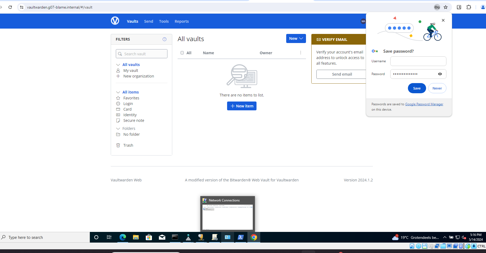
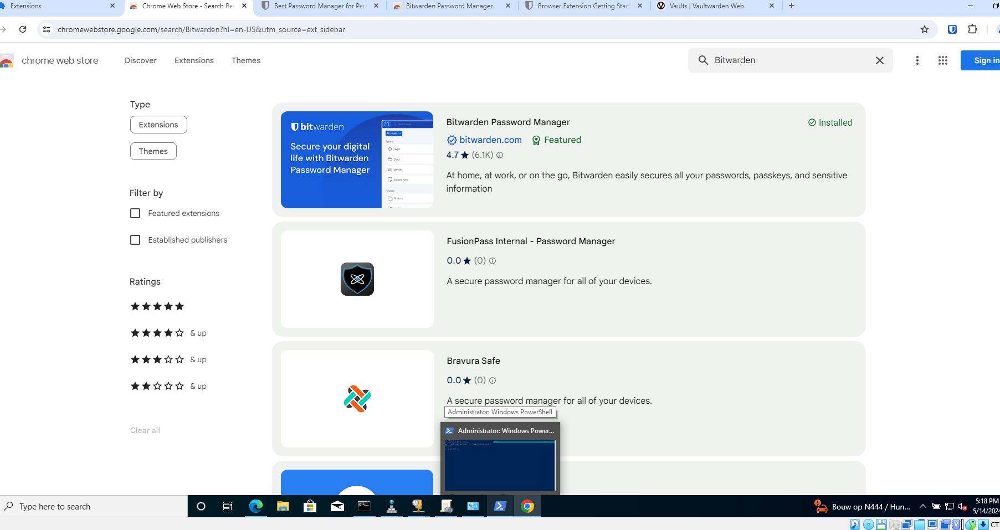
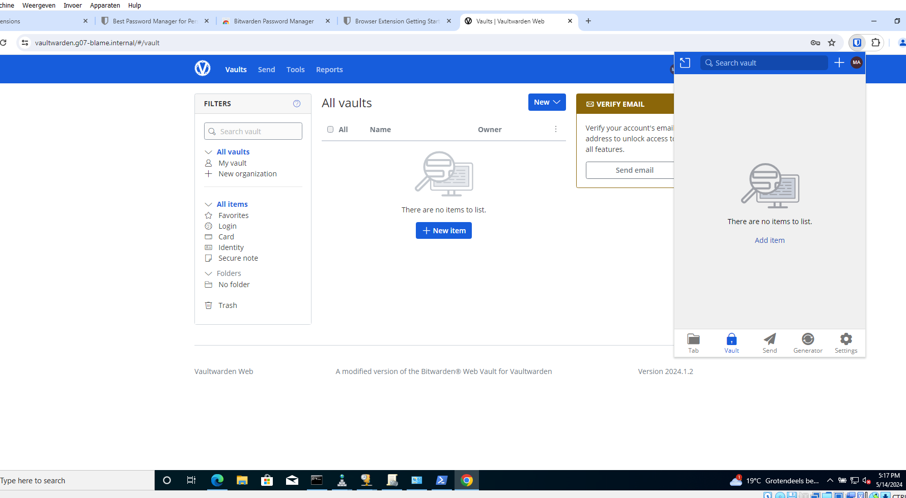
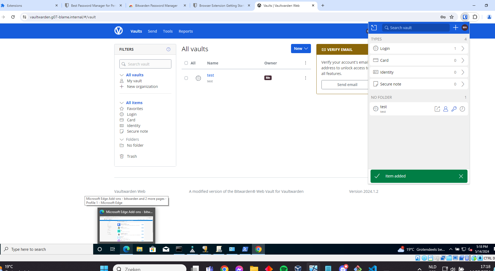

# Testrapport: Uitbreiding: Vaultwarden/Bitwarden

- Auteur(s) respectievelijke testplan: Matteo Alexander
- Uitvoerder(s) test: Lucas Ludueña-Segre
- Uitgevoerd op: 14/05/2024

## Test: Uitbreiding: Vaultwarden/Bitwarden

Test procedure:

- Opzetten omgeving

    1. Zorg ervoor dat de db, extra, rp vm's draaien

- Testen werking Vaultwarden/Bitwarden

    1. Open op de client de browser en surf naar: vaultwarden.g07-blame.internal. Normaal zou je deze pagina moeten zien verschijnen:

    2. Login of maak een account aan. Normaal zou je op de homepagina moeten belanden.

    3. Open nu extensies en zoek voor de nieuwe extensie "Bitwarden Password Manager". Installeer deze extensie en open het.

    4. Onder de email sectie heb je: Logging in on. Kies bij deze optie Self-hosted en geef deze url in: vaultwarden.g07-blame.internal.

    5. Log nu in met je reeds gemaakte account. Als alles goed gaat beland je op de pagina van daarnet, maar dan in het klein in de extensie.

    6. Maak nu een nieuw item aan. bv: naam: Facebook, username: Matteo, ww: wachtwoord. Sla dit op.

    7. Indien alles goed is verlopen kan je nu op de webpagina het nieuwe item zien verschijnen!


Verkregen resultaat:

- Opzetten omgeving

    1. Zorg ervoor dat de db, extra, rp vm's draaien

    (De database en reverse proxy draaien op de andere laptops, vandaar dat enkel de extra webserver hier draait)

    ```
    lucas@Findux:~/sep2324-gent-g07/opdrachten/Linux/Vagrant-VirtualeMachine$ vagrant status
    Current machine states:

    db                        not created (virtualbox)
    web                       not created (virtualbox)
    rp                        not created (virtualbox)
    tftp                      not created (virtualbox)
    extra                     running (virtualbox)
    rp-tf                     not created (virtualbox)

    This environment represents multiple VMs. The VMs are all listed
    above with their current state. For more information about a specific
    VM, run `vagrant status NAME`.
    ```

- Testen werking Vaultwarden/Bitwarden
    
    1. Open op de client de browser en surf naar: vaultwarden.g07-blame.internal.

    2. Login of maak een account aan. Normaal zou je op de homepagina moeten belanden.

    

    3. Open nu extensies en zoek voor de nieuwe extensie "Bitwarden Password Manager". Installeer deze extensie en open het.

    

    4. Onder de email sectie heb je: Logging in on. Kies bij deze optie Self-hosted en geef deze url in: vaultwarden.g07-blame.internal.

    5. Log nu in met je reeds gemaakte account. Als alles goed gaat beland je op de pagina van daarnet, maar dan in het klein in de extensie.

    

    6. Maak nu een nieuw item aan. bv: naam: Facebook, username: Matteo, ww: wachtwoord. Sla dit op.

    7. Indien alles goed is verlopen kan je nu op de webpagina het nieuwe item zien verschijnen!

    

Test geslaagd:

- [x] Ja
- [ ] Nee

Opmerkingen:

- De teststappen via de browser verliepen via een aparte laptop, aangezien op mijn laptop maar één netwerkadapter is die enkel met één VLAN kan verbinden.