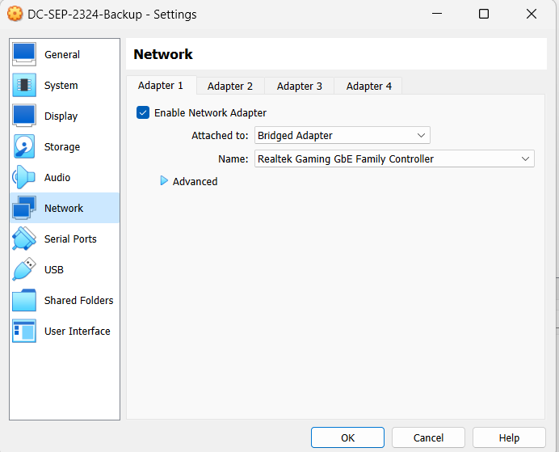
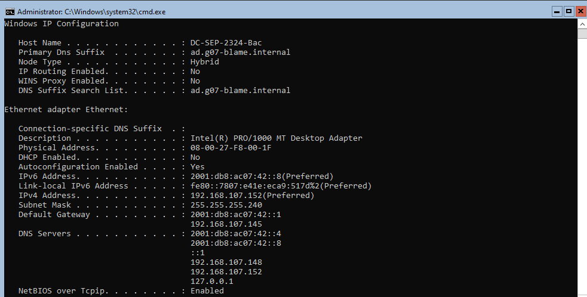
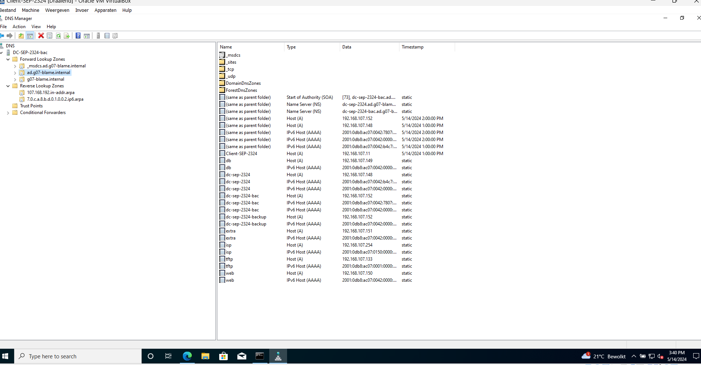
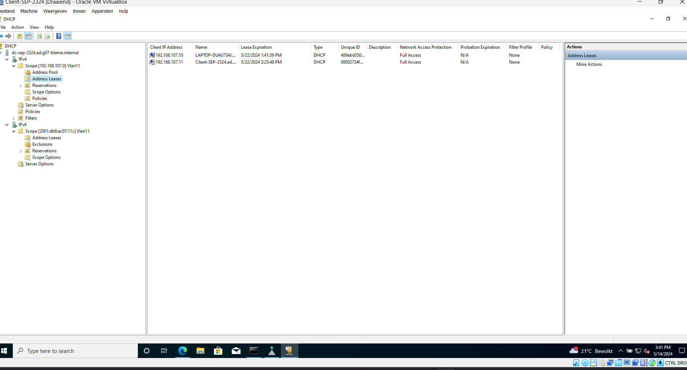

# Testrapport: Backup Windows Server

-Auteur(s): Emiel Lauwers

## Test : Aanmaken Virtuele machine

Testprocedure:

1) Open virtualbox
2) Controleer of de VM is aangemaakt
3) Controlleer of de VM op de juiste bridge adapter is aangesloten

Verkregen resultaat:

- Aanmaken van de VM verloopt zonder problemen
- VM is aangesloten op de juiste bridge adapter

Test geslaagd:

- [x] ja
- [ ] nee

    

## Test : Backup Windows Server

Testprocedure:

1) Open de Windows Server VM
2) Controleer de ip instellingen van de server
3) Controlleer de DNS server instellingen
4) Controleer de DHCP server instellingen

Verkregen resultaat:

- De ip instellingen van de server zijn correct
- De DNS server is correct ingesteld
- De DHCP server is correct ingesteld

Test geslaagd:

- [x] ja
- [ ] nee

    
    
    

    
