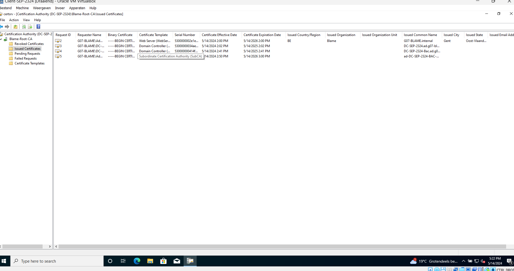

# Testrapport: Certificate Authority

-Auteur(s): Emiel Lauwers

## Test : Aanmaken Certificate Authority

Testprocedure:

1) Open de Windows Server VM
2) Run het CA script
3) Controleer of de CA correct is aangemaakt
4) Controleer of de CA correct is geconfigureerd
5) Controleer of de reverse proxy een geldig certificaat heeft

Verkregen resultaat:

- De CA is correct aangemaakt
- De CA is correct geconfigureerd
- De reverse proxy heeft een geldig certificaat

Test geslaagd:

- [x] ja
- [ ] nee

    
    
    