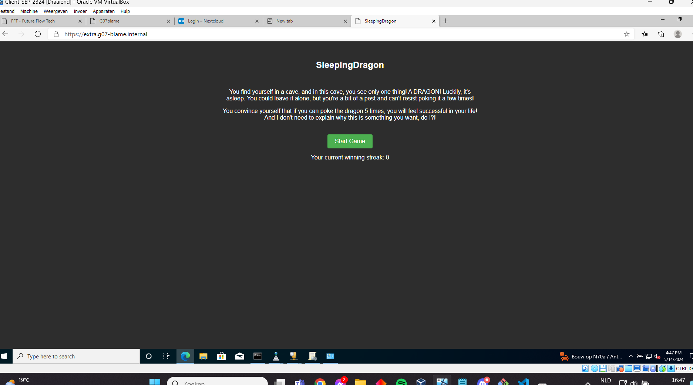

# Testrapport: Extra website

- Auteur(s) respectievelijke testplan: Matteo Alexander
- Uitvoerder(s) test: Lucas Ludueña-Segre
- Uitgevoerd op: 14/05/2024

## Test: Extra website

Test procedure:

1. Ga naar de juiste directory *(Hostmachine VM's)*

2. Start de web, db, rp vm op *(Hostmachine VM's)*

3. Log in op de web vm *(Hostmachine VM's)*

4. Bekijk nu de wordpress config file voor de extra website *(Webserver VM)*

5. Probeer nu te surfen naar "extra.g07-blame.internal" je zou nu onze extra website moeten zien verschijnen *(Client-VM)*

Verkregen resultaat:

1. Ga naar de juiste directory *(Hostmachine VM's)*

```
lucas@Findux:~$ cd sep2324-gent-g07/opdrachten/Linux/Vagrant-VirtualeMachine/
lucas@Findux:~/sep2324-gent-g07/opdrachten/Linux/Vagrant-VirtualeMachine$
```

2. Start de web, db, rp vm op *(Hostmachine VM's)*

(De database, reverse proxy en webserver draaien op de andere laptops, vandaar dat enkel de extra webserver hier draait)

```
lucas@Findux:~/sep2324-gent-g07/opdrachten/Linux/Vagrant-VirtualeMachine$ vagrant up extra
```

3. Log in op de web vm *(Hostmachine VM's)*

```
lucas@Findux:~/sep2324-gent-g07/opdrachten/Linux/Vagrant-VirtualeMachine$ vagrant ssh extra

This system is built by the Bento project by Chef Software
More information can be found at https://github.com/chef/bento
[vagrant@extra ~]$ 
```

4. Bekijk nu de wordpress config file voor de extra website *(Webserver VM)*

```
[vagrant@extra conf.d]$ sudo cat /etc/httpd/conf.d/extra.conf
<VirtualHost *:80>
    ServerAdmin webmaster@extra.g07-blame.internal
    ServerName extra.g07-blame.internal
    ServerAlias www.extra.g07-blame.internal
    DocumentRoot /var/www/html/extra

    <Directory /var/www/html/extra/>
        Options FollowSymlinks
        AllowOverride All
        Require all granted
    </Directory>

    ErrorLog /var/log/httpd/extra.g07-blame.internal_error.log
    CustomLog /var/log/httpd/extra.g07-blame.internal_access.log combined
</VirtualHost>
```



Test geslaagd:

- [x] Ja
- [ ] Nee

Opmerkingen:

- 