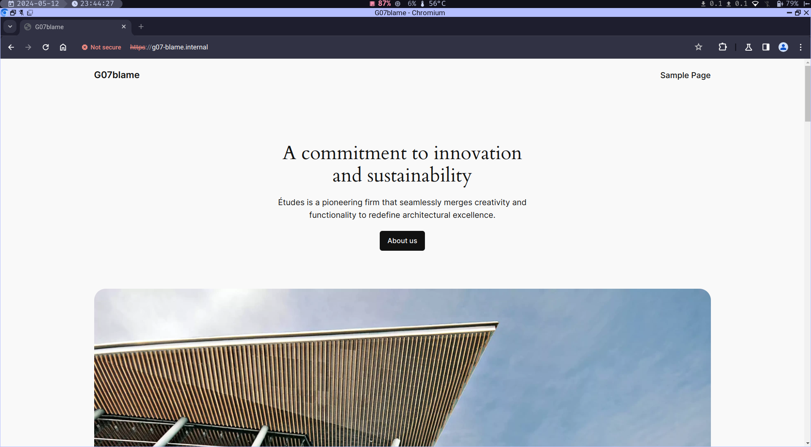

# Testrapport: Linux webserver

- Auteur(s) respectievelijke testplan: Matteo Alexander
- Uitvoerder(s) test: Lucas Ludueña-Segre
- Uitgevoerd op: 12/05/2024

## Test: Linux webserver

Test procedure:

1. Ga naar de juiste directory
2. Start de Webserver vm op
3. Log in op de vm
4. Check of SELinux actief is
5. Bekijk de netwerkinstellingen
6. Test of je de databankserver kan pingen
7. Controleer of de Apache-service actief is
8. Bekijk de firewall instellingen
9. Controlleer de WordPress configuratie
10. Controleer Apache-beveiligingsinstellingen
11. Surf naar "g07-blame.internal" je zou onze website moeten zien verschijnen

Verkregen resultaat:

1. Ga naar de juiste directory

```
lucas@Findux:~$ cd sep2324-gent-g07/opdrachten/Linux/Vagrant-VirtualeMachine/
lucas@Findux:~/sep2324-gent-g07/opdrachten/Linux/Vagrant-VirtualeMachine$
```

2. Start de Webserver vm op

```
lucas@Findux:~/sep2324-gent-g07/opdrachten/Linux/Vagrant-VirtualeMachine$ vagrant up web
```

3. Log in op de vm

```
lucas@Findux:~/sep2324-gent-g07/opdrachten/Linux/Vagrant-VirtualeMachine$ vagrant ssh web

This system is built by the Bento project by Chef Software
More information can be found at https://github.com/chef/bento
[vagrant@web ~]$ 
```

4. Check of SELinux actief is

```
[vagrant@web ~]$ getenforce
Enforcing
```

5. Bekijk de netwerkinstellingen

```
[vagrant@web ~]$ ip a
1: lo: <LOOPBACK,UP,LOWER_UP> mtu 65536 qdisc noqueue state UNKNOWN group default qlen 1000
    link/loopback 00:00:00:00:00:00 brd 00:00:00:00:00:00
    inet 127.0.0.1/8 scope host lo
       valid_lft forever preferred_lft forever
    inet6 ::1/128 scope host 
       valid_lft forever preferred_lft forever
2: eth0: <BROADCAST,MULTICAST,UP,LOWER_UP> mtu 1500 qdisc fq_codel state UP group default qlen 1000
    link/ether 08:00:27:a7:59:a3 brd ff:ff:ff:ff:ff:ff
    altname enp0s3
    inet 10.0.2.15/24 brd 10.0.2.255 scope global dynamic noprefixroute eth0
       valid_lft 84595sec preferred_lft 84595sec
    inet6 fe80::5989:9941:147c:de96/64 scope link noprefixroute 
       valid_lft forever preferred_lft forever
3: eth1: <BROADCAST,MULTICAST,UP,LOWER_UP> mtu 1500 qdisc fq_codel state UP group default qlen 1000
    link/ether 08:00:27:c9:6d:45 brd ff:ff:ff:ff:ff:ff
    altname enp0s8
    inet 192.168.0.2/24 brd 192.168.0.255 scope global noprefixroute eth1
       valid_lft forever preferred_lft forever
    inet6 fe80::a00:27ff:fec9:6d45/64 scope link 
       valid_lft forever preferred_lft forever
```

6. Test of je de databankserver kan pingen

```
[vagrant@web ~]$ ping 192.168.0.3
PING 192.168.0.3 (192.168.0.3) 56(84) bytes of data.
64 bytes from 192.168.0.3: icmp_seq=1 ttl=64 time=0.549 ms
64 bytes from 192.168.0.3: icmp_seq=2 ttl=64 time=0.634 ms
64 bytes from 192.168.0.3: icmp_seq=3 ttl=64 time=0.647 ms
64 bytes from 192.168.0.3: icmp_seq=4 ttl=64 time=0.632 ms
^C
--- 192.168.0.3 ping statistics ---
4 packets transmitted, 4 received, 0% packet loss, time 3078ms
rtt min/avg/max/mdev = 0.549/0.615/0.647/0.038 ms
```

7. Controleer of de Apache-service actief is

```
[vagrant@web ~]$ sudo systemctl status httpd
WARNING: terminal is not fully functional
Press RETURN to continue 
● httpd.service - The Apache HTTP Server
     Loaded: loaded (/usr/lib/systemd/system/httpd.service; enabled; preset: disabled)
    Drop-In: /usr/lib/systemd/system/httpd.service.d
             └─php-fpm.conf
     Active: active (running) since Sun 2024-05-12 21:26:46 UTC; 37min ago
       Docs: man:httpd.service(8)
   Main PID: 7187 (httpd)
     Status: "Total requests: 53; Idle/Busy workers 100/0;Requests/sec: 0.0235; Bytes served/s>
      Tasks: 230 (limit: 11054)
     Memory: 35.7M
        CPU: 1.407s
     CGroup: /system.slice/httpd.service
             ├─7187 /usr/sbin/httpd -DFOREGROUND
             ├─7188 /usr/sbin/httpd -DFOREGROUND
             ├─7189 /usr/sbin/httpd -DFOREGROUND
             ├─7190 /usr/sbin/httpd -DFOREGROUND
             ├─7191 /usr/sbin/httpd -DFOREGROUND
             └─7474 /usr/sbin/httpd -DFOREGROUND

May 12 21:26:46 web systemd[1]: Starting The Apache HTTP Server...
May 12 21:26:46 web httpd[7187]: AH00558: httpd: Could not reliably determine the server's ful>
May 12 21:26:46 web httpd[7187]: Server configured, listening on: port 80
May 12 21:26:46 web systemd[1]: Started The Apache HTTP Server.
lines 1-23/23 (END)
```

8. Bekijk de firewall instellingen

```
[vagrant@web ~]$ sudo firewall-cmd --list-all
public (active)
  target: default
  icmp-block-inversion: no
  interfaces: eth0 eth1
  sources: 
  services: cockpit dhcpv6-client ssh
  ports: 
  protocols: 
  forward: yes
  masquerade: no
  forward-ports: 
  source-ports: 
  icmp-blocks: 
  rich rules: 
	rule family="ipv4" source address="192.168.0.4" port port="80" protocol="tcp" accept
```

9. Controlleer de WordPress configuratie

```
[vagrant@web ~]$ sudo cat /var/www/html/wordpress/wp-config.php                                                                                                                               
<?php
define( 'DB_NAME', 'wordpress_db' );
define( 'DB_USER', 'wordpress_user' );
define( 'DB_PASSWORD', 'Kof3Cup.ByRu' );
define( 'DB_HOST', '192.168.0.3' );
define( 'DB_CHARSET', 'utf8mb4' );
define( 'DB_COLLATE', '' );

$table_prefix = 'wp_';
define( 'WP_DEBUG', false );
if ( ! defined( 'ABSPATH' ) ) {
    define( 'ABSPATH', __DIR__ . '/' );
}
# Controleer of de array-sleutel bestaat voordat je deze gebruikt http_forwarder
if (isset($_SERVER['HTTP_X_FORWARDED_PROTO']) && $_SERVER['HTTP_X_FORWARDED_PROTO'] == 'https') {
    $_SERVER['HTTPS'] = 'on';
}
#controleer of de array sleutel bestaat voordat je deze gebruikt httpost
if (isset($_SERVER['HTTP_HOST'])) {
    $http_host = $_SERVER['HTTP_HOST'];
} else {
    // Set a default value or handle the case when HTTP_HOST is not set
    $http_host = 'your_default_host';
}
require_once ABSPATH . 'wp-settings.php';
```

10. Controleer Apache-beveiligingsinstellingen

```
[vagrant@web ~]$ sudo cat /etc/httpd/conf/httpd.conf | grep -E "ServerTokens|ServerSignature"
ServerTokens Prod
ServerSignature Off
```

11. Surf naar "g07-blame.internal" je zou onze website moeten zien verschijnen



Test geslaagd:

- [x] Ja
- [ ] Nee

Opmerkingen:

- Deze test werd uitgevoerd in een lokale omgeving buiten het serverlokaal op de campus. Hierdoor kwamen de IP-adressen niet overeen met de verwachte output, maar de werking bleef hetzelfde.
