# Testrapport: Windows Server

-Auteur(s): Emiel Lauwers

## Test : Aanmaken Virtuele machines

Testprocedure:

1) Open virtualbox
2) Controleer of de VM's zijn aangemaakt
2) Controlleer of de VM's op de juiste bridge adapter zijn aangesloten

Verkregen resultaat:

- Aanmaken van de VM's verloopt zonder problemen
- VM's zijn aangesloten op de juiste bridge adapter

Test geslaagd:

- [x] ja
- [ ] nee

    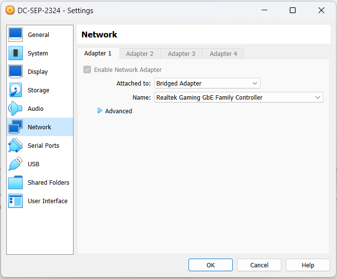
    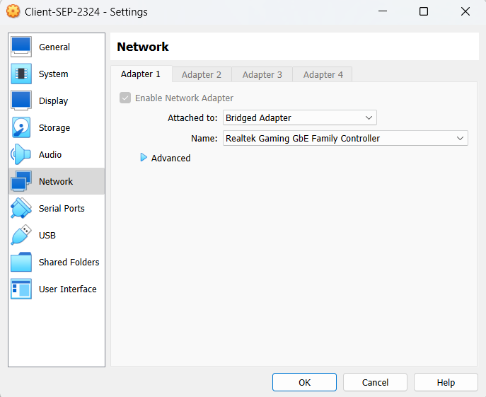

## Test : Windows Server

Testprocedure:

1) Open de Windows Server VM
2) Controleer de ip instellingen van de server
3) Controlleer de DNS server instellingen
4) Controleer de DHCP server instellingen
5) Controleer of de shared folders correct zijn aangemaakt
6) Controleer of de GPO's correct zijn aangemaakt

Verkregen resultaat:

- De ip instellingen van de server zijn correct
- De DNS server is correct ingesteld
- De DHCP server is correct ingesteld
- De shared folders zijn correct aangemaakt

Test geslaagd:

- [x] ja
- [ ] nee

    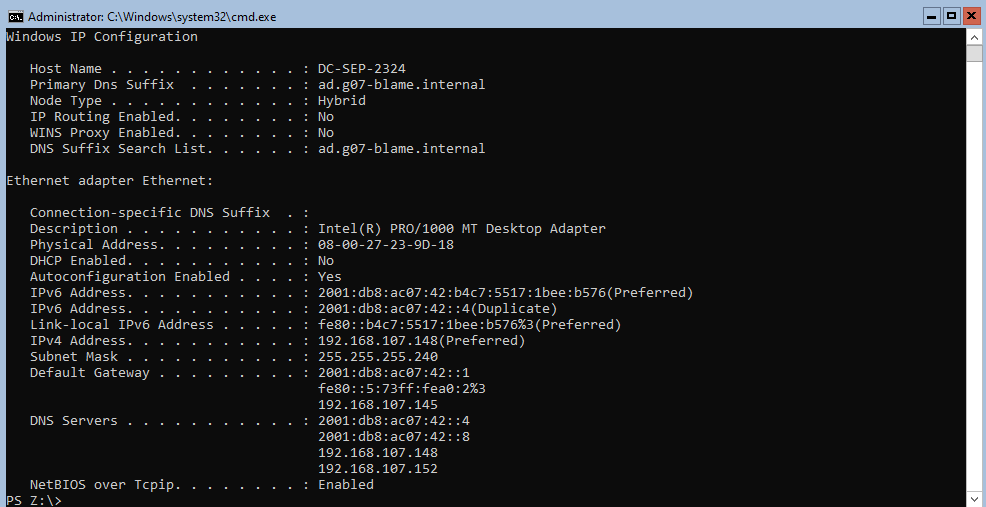
    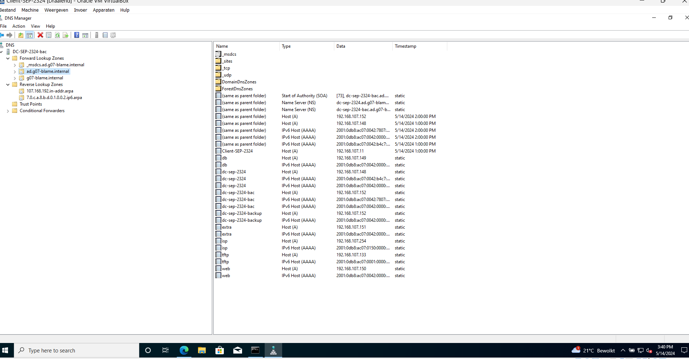
    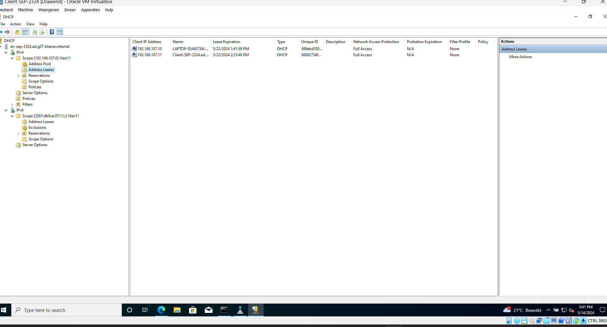
    
    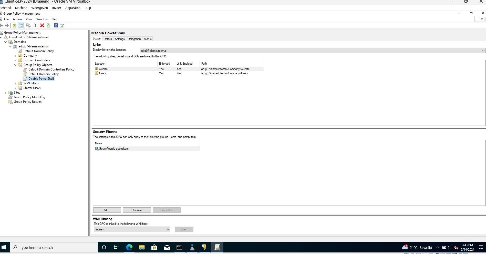

## Test : Windows Client

Testprocedure:

1) Open de Windows Client VM
2) Controleer de ip instellingen van de client
3) Controleer of je naar de website kan surfen
4) Controleer of client in het domein zit
5) Controleer of de RSAT tools aanwezig zijn
6) Controleer of je kan inloggen als domain admin
7) Controleer of of je toegang hebt tot de shared folders
8) Controleer of je powershell kan openen

Verkregen resultaat:

- De ip instellingen van de client zijn correct
- Je kan naar de website surfen
- De client zit in het domein
- De RSAT tools zijn aanwezig
- Je kan inloggen als domain admin
- Je hebt toegang tot alleen de shared folder die geassocieerd is met de een persoon tenzij je als domain admin inlogt
- Je kan powershell niet openen tenzij je als admin inlogt

Test geslaagd:

- [x] ja
- [ ] nee

    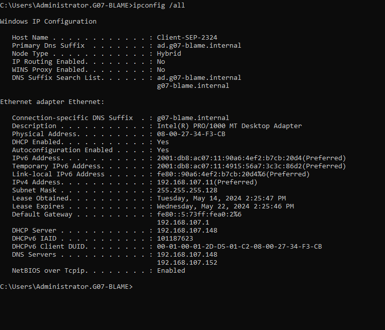
    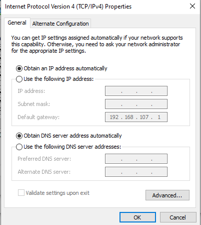
    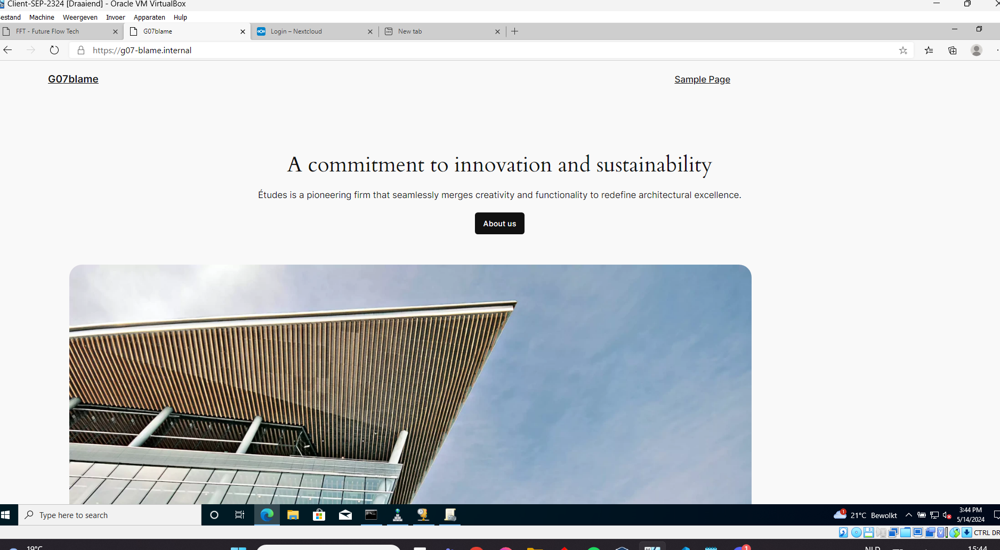
    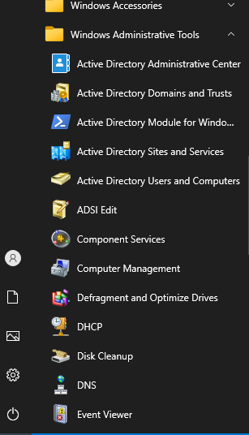
    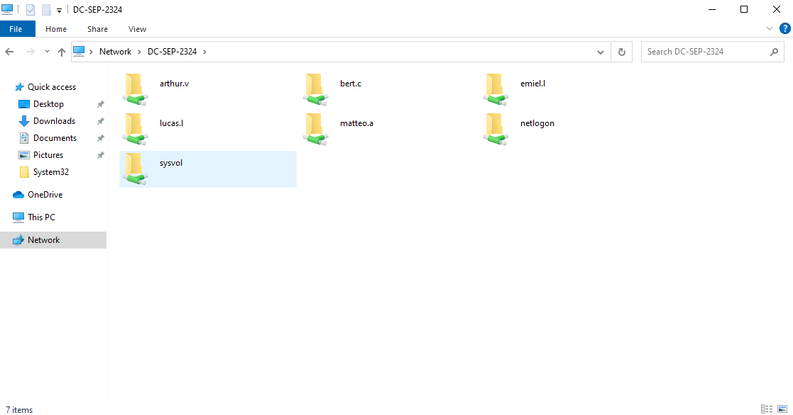
    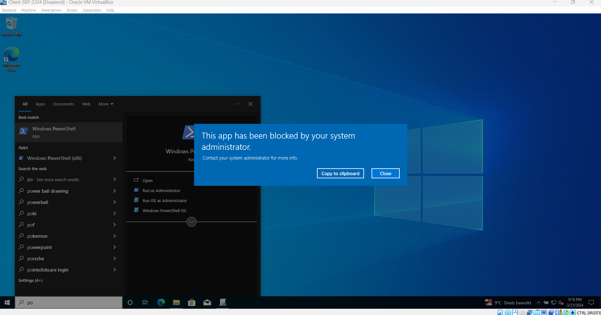