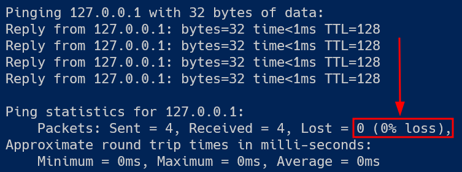
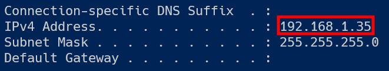
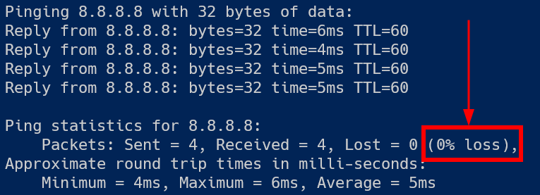
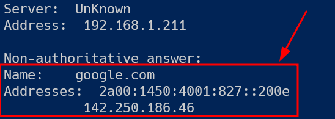

# Testplan

:exclamation: **Let op**: Dit voorbeeld is het **absolute minimum** dat we verwachten. Jouw actuele testdocumenten zijn best meer uitgebreid en gedetailleerder! Er mag geen verwarring of ruimte voor interpretatie zijn.

- Auteur(s) testplan: Annelies Vermere

## Test: Kan de Windows client zichzelf pingen voor IPv4?

Test procedure:

1. Open een Powershell venster.
2. Voer het commando `ping 127.0.0.1` uit in het Powershell venster. Gebruik niet `localhost`, want dan zou het kunnen dat IPv6 wordt getest (`::1`) i.p.v. IPv4.

Verwacht resultaat:

- Alle pings zijn succesvol.
- De round trip times zijn telkens bijna instant (minder dan 1 ms).

  

## Test: Is het IP-adres van de Windows client correct ingesteld?

Testprocedure:

1. Open een Powershell venster.
2. Voer het commando `ipconfig` uit in het Powershell venster.

Verwacht resultaat:

- Het IPv4-adres is `192.168.45.1`:

  

## Test: Kan de Windows client aan het internet?

Testprocedure:

1. Open een Powershell venster.
2. Voer het commando `ping 8.8.8.8` uit in het Powershell venster.

Verwacht resultaat:

- Ping is gelukt:

  

## Test: Kan de Windows client DNS resolven?

Testprocedure:

1. Open een Powershell venster.
2. Voer het commando `nslookup duckduckgo.com` uit in het Powershell venster.

Verwacht resultaat:

- `nslookup` kan het IP-adres opvragen:

  
