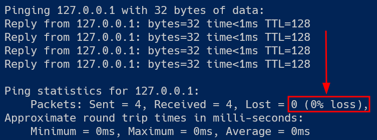
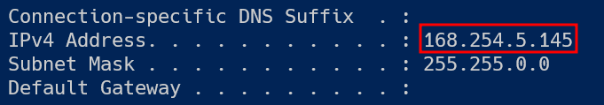
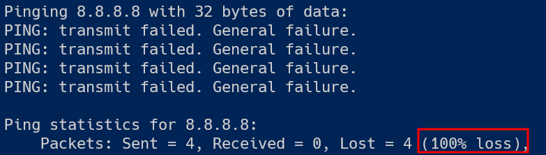

# Testrapport

:exclamation: **Let op**: Dit voorbeeld is het **absolute minimum** dat we verwachten. Jouw actuele testdocumenten zijn best meer uitgebreid en gedetailleerder! Er mag geen verwarring of ruimte voor interpretatie zijn.

- Uitvoerder(s) test: Lars de Waele
- Uitgevoerd op: 25 maart 2023
- Github commit: [2a1a1fb](https://github.com/HoGentTIN/sep-2324-template/commit/2a1a1fb70b36acaf5c632613f5a329dc832fea6d)

## Test: Kan de Windows client zichzelf pingen voor IPv4?

Test procedure:

1. Open een Powershell venster.
2. Voer het commando `ping 127.0.0.1` uit in het Powershell venster. Gebruik niet `localhost`, want dan zou hte kunnen dat IPv6 wordt getest (`::1`) i.p.v. IPv4.

Verkregen resultaat:

- De locale IPv4 stack van de client kan antwoorden op de pings.
- De round trip times zijn minder dan 1 ms voor elke ping.

  

Test geslaagd:

- [x] Ja
- [ ] Nee

Opmerkingen:

- /

## Test: Is het IP-adres van de Windows client correct ingesteld?

Test procedure:

1. Open een Powershell venster.
2. Voer het commando `ipconfig` uit in het Powershell venster.

Verkregen resultaat:

- Het IPv4-adres staat foutief ingesteld op `168.254.5.145`.

  

Test geslaagd:

- [ ] Ja
- [x] Nee

Opmerkingen:

- Het verkregen adres is een [APIPA-adres](https://wiki.wireshark.org/APIPA). Vermoedelijk is er geen DHCP aanwezig?

## Test: Kan de Windows client aan het internet?

Testprocedure:

1. Open een Powershell venster.
2. Voer het commando `ping 8.8.8.8` uit in het Powershell venster.

Verkregen resultaat:

- Er is voor geen enkele ping een antwoord ontvangen:

  

Test geslaagd:

- [ ] Ja
- [x] Nee

Opmerkingen:

- Vermoedelijk omdat de IP-instellingen niet kloppen.

## Test: Kan de Windows client DNS resolven?

Testprocedure:

1. Open een Powershell venster.
2. Voer het commando `nslookup duckduckgo.com` uit in het Powershell venster.

Verkregen resultaat:

- De client kan geen IP-adres vinden voor `google.com`:

  

Test geslaagd:

- [ ] Ja
- [x] Nee

Opmerkingen:

- Is er een DNS server ingesteld?
