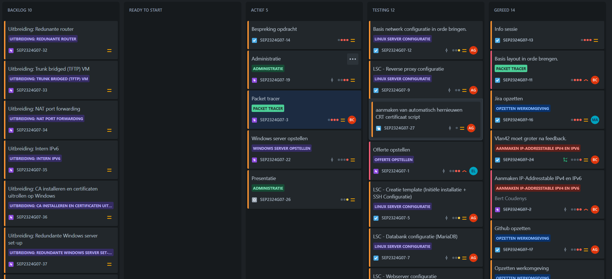
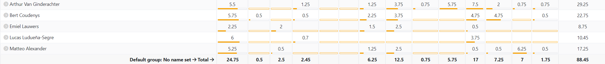
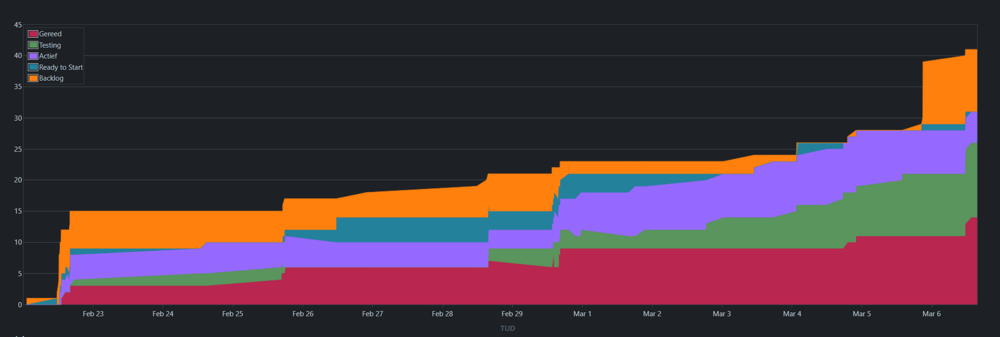
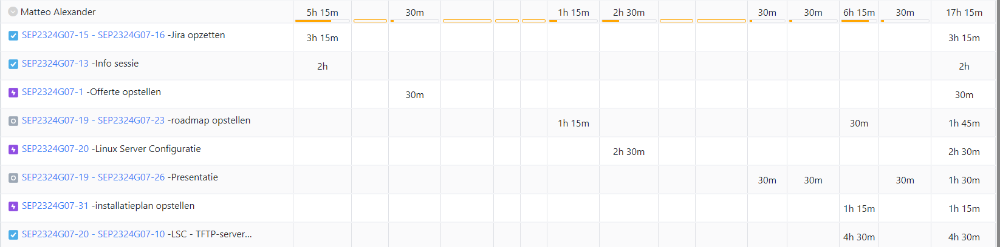
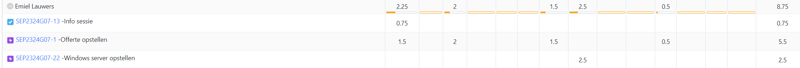
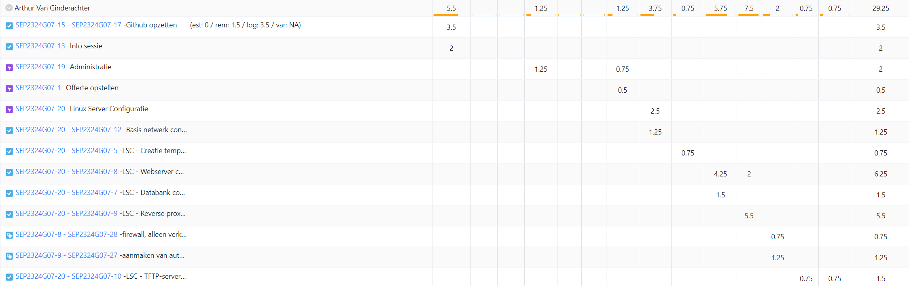
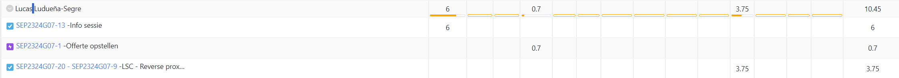
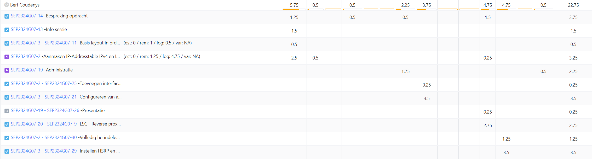

# Opvolgingsrapport 1

## Algemeen

- Groep: G07
- Periode: 22/2/24 tot 06/3/24
- Datum voortgangsgesprek: 07/3/2024

| Student                 | Afw. | Opmerking |
| :---------------------- | :--: | :-------- |
| Matteo Alexander        |      |           |
| Emiel Lauwers           |      |           |
| Arthur Van Ginderachter |      |           |
| Lucas Ludueña-Segre     |      |           |
| Bert Coudenys           |      |           |

## Wat heb je deze periode gerealiseerd?

### Algemeen

- Elk groepslid heeft samen deelgenomen aan de infosessie op 22/02.
- Na deze infosessie hebben wij elk van de Q&A-sessies bijgewoond.
- Hebben na de Q&A-sessies op 22/02 de opdracht samen besproken en aan taakverdeling gedaan voor zowel het opzetten van eventuele services zoals GitHub en met welk systeem we gaan werken. Als Jira voor ons KanBan bord.
- De packet tracer is dan bekeken en opgesteld.
- Na het opstellen van de packet tracer was het mogelijk om een accurate offerte op te stellen. Dit hebben we gedaan.
- Er is een adressentabel opgesteld voor zowel IPv4 als voor IPv6.
- De packet tracer is geconfigureerd met alle bassis netwerk instellingen, vlans, routes, trunks, etc... ook HSRP IPv4 is in orde gebracht. Klaar om te testen! IPv6 90% af, uitsluitend hsrpv2.
- Alle linux scripts voor de servers zijn volledig af. Klaar voor testen.
- Windows server vm in orde gebracht en win client ook.

#### KanBan

#### Tijdsregistratie

#### Cumulatief flowdiagram

### Matteo Alexander

<!-- Voeg hier een overzicht toe van gerealiseerde taken inclusief links naar relevante commits/documenten. -->

- Jira opgezet voor de groep
- Geholpen bij de offerte
- Roadmap aangemaakt voor komende 12 weken
- Installatieplan opgesteld
- Meegeholpen met opstellen TFTP-server
- Presentatie gemaakt

<!-- Voeg hier een screenshot van het individueel tijdregistratierapport, met overzicht van elke taak en bijhorende uren. -->

### Emiel Lauwers

<!-- Voeg hier een overzicht toe van gerealiseerde taken inclusief links naar relevante commits/documenten. -->

- Bijgewoond aan de infosessie en Q&A. -> SEP2324G07-13
- Bespreking opdracht met team. -> SEP2324G07-14
- Offerte opstellen -> dd0735
- Windows server vm in orde gebracht en win client. -> a7b6f9

<!-- Voeg hier een screenshot van het individueel tijdregistratierapport, met overzicht van elke taak en bijhorende uren. -->

### Arthur Van Ginderachter

<!-- Voeg hier een overzicht toe van gerealiseerde taken inclusief links naar relevante commits/documenten. -->

- opzetten Github en git omgeving --> ba1dea
- Offerte van EMiel helpen opzetten
- Systeem opgesteld voor gebruik GIt voor de hele groep. + kleine uitleg sessie
- Administratie zoals opvolgingen en Readme's aangepast en templates goed gezet voor gebruik
- Alle Linux omgevingen en scripts in orde gebracht. -> 219c166

<!-- Voeg hier een screenshot van het individueel tijdregistratierapport, met overzicht van elke taak en bijhorende uren. -->

### Lucas Ludueña-Segre

<!-- Voeg hier een overzicht toe van gerealiseerde taken inclusief links naar relevante commits/documenten. -->

- Informatie rond linux servers en windows server opgezocht.
- Helpen met Offerte opstellen. --> d4aee33
- Reverse proxy server helpen opzetten.
- Bespreking opdracht met team.
<!-- Voeg hier een screenshot van het individueel tijdregistratierapport, met overzicht van elke taak en bijhorende uren. -->

### Bert Coudenys

<!-- Voeg hier een overzicht toe van gerealiseerde taken inclusief links naar relevante commits/documenten. -->

- Bijgewoond aan de infosessie en Q&A. -> SEP2324G07-13
- Bespreking opdracht met team meerdere keren. -> SEP2324G07-14
- Basis layout en configuratie van packet tracer file in orde brengen. Ook toevoegen HSRP voor IPv4. -> SEP2324G07-11, SEP2324G07-21, SEP2324G07-29, SEP2324G07-42
- IP-addressering table aangemaakt en ingevuld met zowel IPv4 als IPv6 adressen, ook interface tabel toegevoegd. En up to date gehouden. -> SEP2324G07-2, SEP2324G07-24, SEP2324G07-25, SEP2324G07-30, SEP2324G07-43
- Opvolgingsrapport nr1 opstellen. -> SEP2324G07-19
- Arthur geholpen met het configureren van de proxy server. -> SEP2324G07-9
- Geholpen met de bash scripts en ook controlleren/testen van die scripts.

## Wat plan je volgende periode te doen?

### Algemeen

<!-- Voeg hier de doelstellingen toe voor volgende periode. -->

- Alle configuraties uit testen op de equipment.
- Aanpassingen maken na feedback.
- Bekijken van eventueele leuke/goede uitbreidingen.
- Verder uitwerken van Windows server en windows client automatisatie.
- Hsrp voor ipv6 in orde brengen.

### Matteo Alexander

- Helpen bij Windows Servers en samenwerken met Emiel
- Helpen waar nodig (bv: uitbreiding?)

### Emiel Lauwers

- Windows server aanmaken + automatisatie met Active Directory, DNS server, Domain controller

### Arthur Van Ginderachter

- Helpen Bij Linux en samenwerken met Lucas

### Lucas Ludueña-Segre

- Eventuele uitbreidingen op linux.
- Samen met Emiel kijken voor eventuele hulp bij win serv.

### Bert Coudenys

- Zorgen dat mijn configuraties goed overgaan op effectieve hardware.
- HSRPv2 implementeren.
- Helpen bij het herconfigureren van Linux waar nodig.

## Retrospectieve

### Wat doen jullie goed?

- Taakverdeling gaat zeer goed. En is altijd duidelijk.
- Communicatie gaat ook zeer vlot. We hebben een Discord-server en iedereen reageert altijd binnen acceptabele tijd.
- Technische kennis. Er is duidelijk veel ervaring en technische kennis aanwezig in deze groep!

### Waar hebben jullie nog problemen mee?

- Structuur. In het begin was het even chaos om voor de volledige opdracht volledig "On the same page" te zijn. Hoewel dit al relatief goed is na verloop van de eerste weeken. Heeft dit soms voor verwarring en frustraties gezorgd.

### Feedback

#### Groep

#### Matteo Alexander

#### Emiel Lauwers

#### Arthur Van Ginderachter

#### Lucas Ludueña-Segre

#### Bert Coudenys
