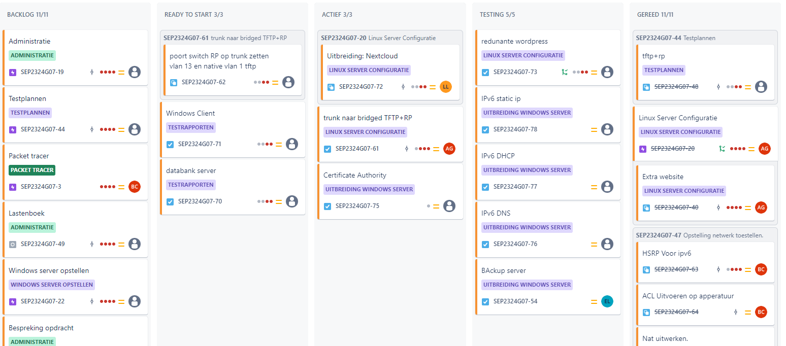
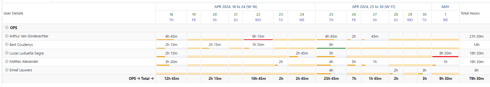
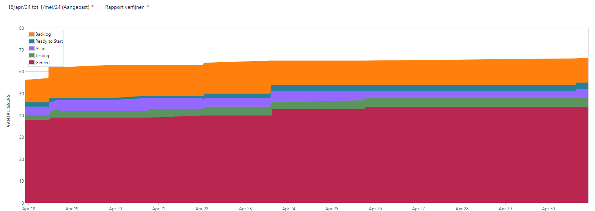
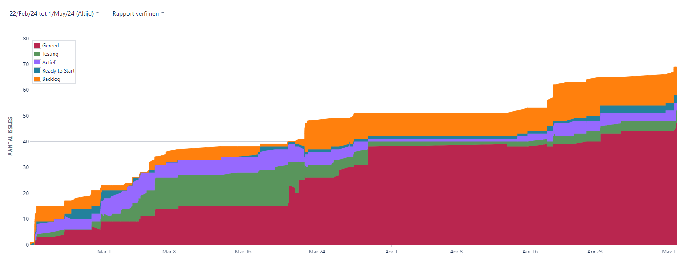
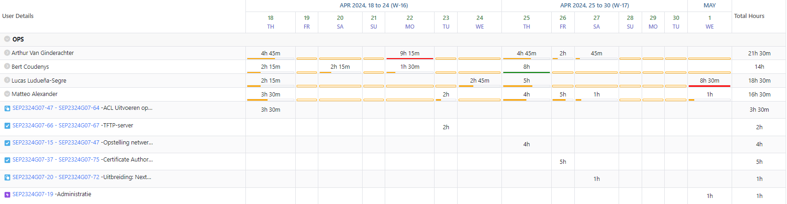
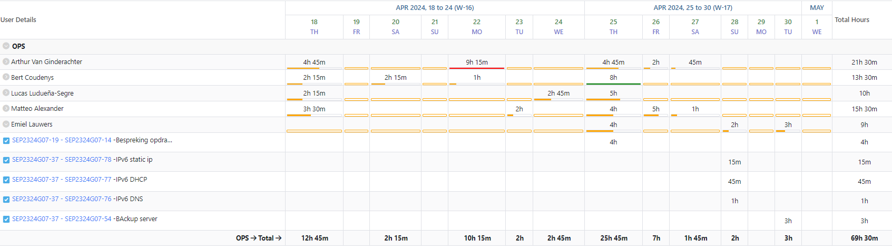
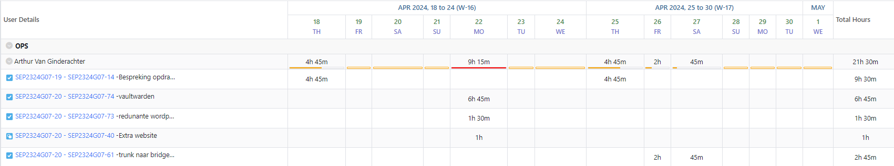
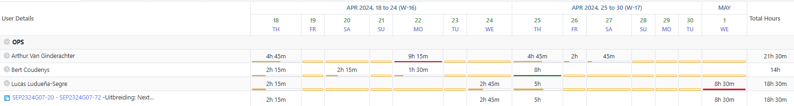
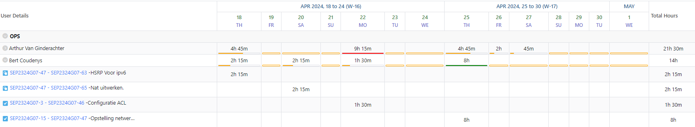

# Opvolgingsrapport week 6

## Algemeen

- Groep: G07
- Periode: 18/04/24 tot 01/05/24
- Datum voortgangsgesprek: 02/05/2024

| Student                 | Afw. | Opmerking |
| :---------------------- | :--: | :-------- |
| Matteo Alexander        |      |           |
| Emiel Lauwers           |      |           |
| Arthur Van Ginderachter |      |           |
| Lucas Ludueña-Segre     |      |           |
| Bert Coudenys           |      |           |

## Wat heb je deze periode gerealiseerd?

### Algemeen

- Vaultwarden geimplementeerd
- Redunante wordpress opgesteld
- Verder gewerkt aan de Nextcloud opstelling
- Verder gewerkt aan de Trunk naar bridged TFTP vm uitbreiding 
- Nat uitgewerkt voor het netwerk
- HSRPv6 uitgewerkt
- ACL's geconfigureert
- ipv6 voor windows uitgewerkt
- Backup windows server afgewerkt
- Client script geüpdate voor nextcloud

#### KanBan

#### Tijdsregistratie

#### Cumulatief flowdiagram week 10

#### Cumulatief flowdiagram gehele periode

### Matteo Alexander

<!-- Voeg hier een overzicht toe van gerealiseerde taken inclusief links naar relevante commits/documenten. -->

- Testrapport voor TFTP server en RP server geschreven -> SEP2324G07-67
- Client script aangepast voor nextcloud implementatie -> SEP2324G07-72
- Certificate Authority proberen implementeren voor wordpress site (niet gelukt)
- Opvolgingsrapport opgesteld -> SEP2324G07-19

<!-- Voeg hier een screenshot van het individueel tijdregistratierapport, met overzicht van elke taak en bijhorende uren. -->

### Emiel Lauwers

<!-- Voeg hier een overzicht toe van gerealiseerde taken inclusief links naar relevante commits/documenten. -->

- ipv6 voor windows uitgewerkt (dns, static ip, dhcp) -> SEP2324G07-76, SEP2324G07-78, SEP2324G07-77
- Backup windows server afgewerkt -> SEP2324G07-54
- Aanpassingen voor VM script bridged adapters
- Aanpassingen DNS extra website

<!-- Voeg hier een screenshot van het individueel tijdregistratierapport, met overzicht van elke taak en bijhorende uren. -->

### Arthur Van Ginderachter

<!-- Voeg hier een overzicht toe van gerealiseerde taken inclusief links naar relevante commits/documenten. -->

- Verder gewerkt aan de nextcloud uitbreiding -> SEP2324G07-72
- Uitbreiding voor tftp te combineren met bridged native vlan. -> SEP2324G07-61
- Vaultwarden geimplementeerd -> SEP2324G07-74
- Redunante wordpress opgesteld -> SEP2324G07-73

<!-- Voeg hier een screenshot van het individueel tijdregistratierapport, met overzicht van elke taak en bijhorende uren. -->

### Lucas Ludueña-Segre

<!-- Voeg hier een overzicht toe van gerealiseerde taken inclusief links naar relevante commits/documenten. -->

- Verder gewerkt aan de nextcloud uitbreiding -> SEP2324G07-72

<!-- Voeg hier een screenshot van het individueel tijdregistratierapport, met overzicht van elke taak en bijhorende uren. -->

### Bert Coudenys

<!-- Voeg hier een overzicht toe van gerealiseerde taken inclusief links naar relevante commits/documenten. -->

- HSRP voor ipv6 volledig uitgewerkt -> SEP2324G07-63
- Nat volledig uitgewerkt en ge deployed -> SEP2324G07-65
- ACL's in orde gebracht bijna volledig -> SEP2324G07-46
- Externe HSRP getest -> SEP2324G07-63

## Wat plan je volgende periode te doen?

### Algemeen

<!-- Voeg hier de doelstellingen toe voor volgende periode. -->

- Zoveel mogelijk uitbreidingen afwerken
- testrapporten schrijven voor alle testplannen

### Matteo Alexander

- Nog een poging op Certificate Authority uitbreiding
- testplannen van uitbreidingen opstellen
- Helpen waar nodig

### Emiel Lauwers

- Verder optimaliseren van windows omgeving
- Helpen waar nodig

### Arthur Van Ginderachter

- Afwerken uitbreiding: Trunk bridged (TFTP) VM.
- Eventueel starten met TheMatrix uitbreiding
- Eventueel implementeren ipv6 voor linux machines
- Helpen waar nodig
  

### Lucas Ludueña-Segre

- Nextcloud uitbreiding afwerken
- Install wizard automatiseren

### Bert Coudenys

- Netwerk opstelling klaar (aanpassingen indien nodig)
- helpen waar nodig

## Retrospectieve

### Wat doen jullie goed?

- Taken zijn goed verdeeld, iedereen doet zijn deel.
- Communicatie gaat ook zeer vlot. We hebben een Discord-server en iedereen reageert altijd binnen acceptabele tijd.
- Technische kennis. Er is duidelijk veel ervaring en technische kennis aanwezig in deze groep!
- Iedereen wilt elkaar helpen indien iemand vast zit.
- We zitten mooi op schema.

### Waar hebben jullie nog problemen mee?

- De nextcloud uitbreiding geeft nog enkele errors
- De Certificate Authority uitbreiding wilt niet lukken in gui laat staan geautomatiseerd

### Feedback

#### Groep

#### Matteo Alexander

#### Emiel Lauwers

#### Arthur Van Ginderachter

#### Lucas Ludueña-Segre

#### Bert Coudenys

## Uitbreidingen

### Afgewerkt

- IPV6 netwerk ready/ future proof (compleet)
- Redunante Routers (compleet)
- Extra webserver (compleet)
- Reverse Proxy Hardening (compleet)
- Redunante router (compleet)
- Backup server windows (compleet)
- Nat portforwarding (compleet)
- Bitwarden/Vaultwarden (compleet)
- IPV6 windows (compleet)

### In ontwikkeling

- TFTP bridge VM (onder voorbehoud van Meneer Van Maele)
- Nextcloud (ontwikkeling)
- The Matrix (starten)
- ACL's (compleet -> testen)
- Certificate Authority (starten -> poging 2)