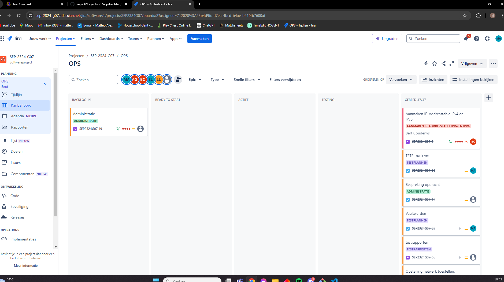
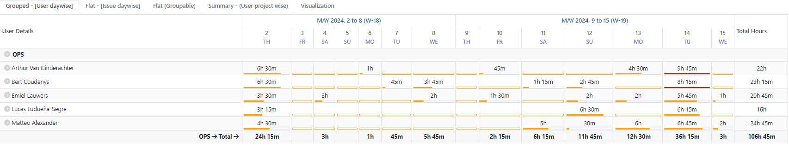
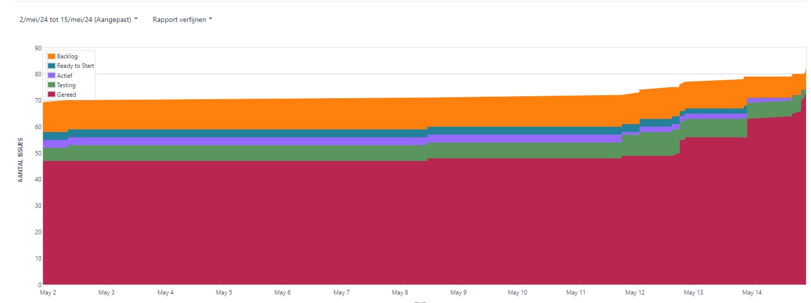
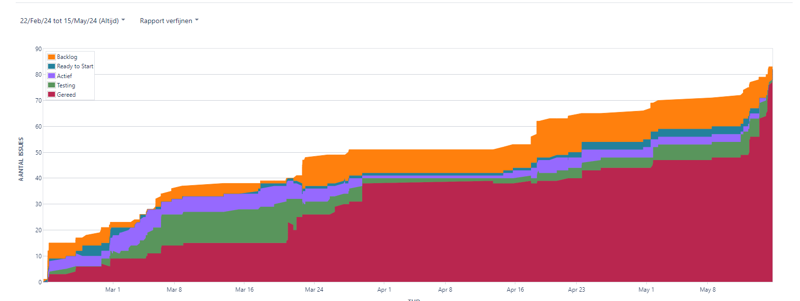
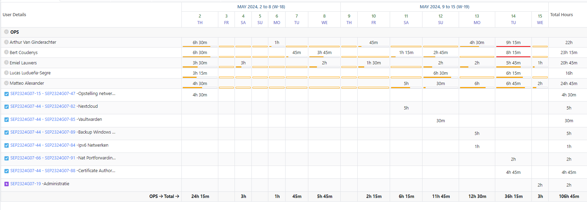
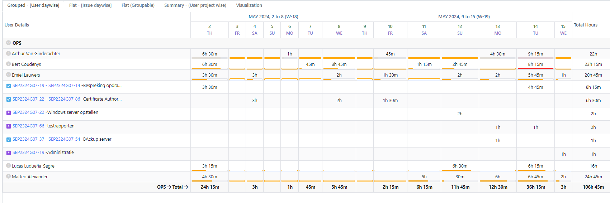
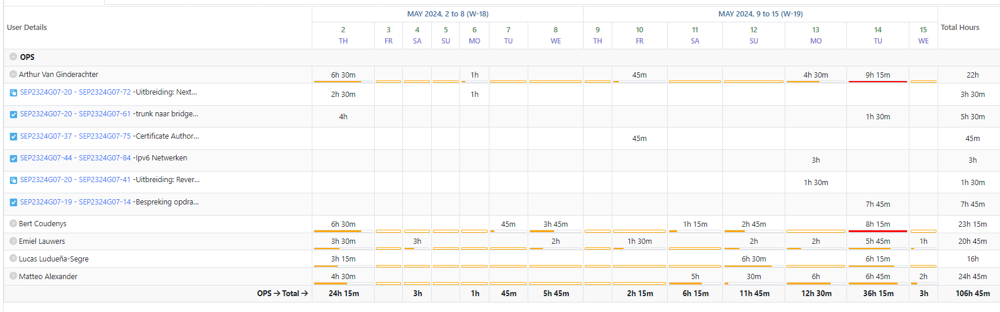
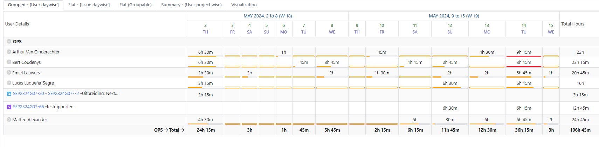
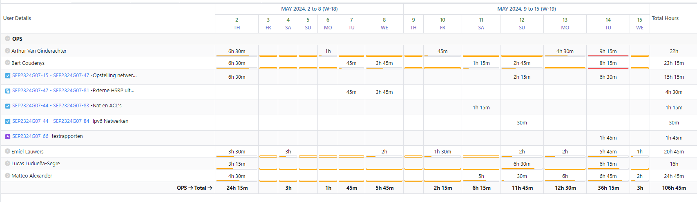

# Opvolgingsrapport week 12

## Algemeen

- Groep: G07
- Periode: 02/05/24 tot 15/05/24
- Datum voortgangsgesprek: 16/05/2024

| Student                 | Afw. | Opmerking |
| :---------------------- | :--: | :-------- |
| Matteo Alexander        |      |           |
| Emiel Lauwers           |      |           |
| Arthur Van Ginderachter |      |           |
| Lucas Ludueña-Segre     |      |           |
| Bert Coudenys           |      |           |

## Wat heb je deze periode gerealiseerd?

### Algemeen

- Nextcloud uitbreiding afgewerkt
- Trunk naar bridged vm uitbreiding afgewerkt
- Certificate Authority uitbreiding afgewerkt
- ipv6 uitbreiding uitgerollt op Windows/Linux machines
- Aanpassingen Reverse proxy hardening
- Aanpassingen netwerk voor TFTP en RP op 1 server
- Aanpassingen ACL's
- Externe HSRP uitgewerkt
- Aanmaken testplannen (Nextcloud, Vaultwarden, Tftp naar bridged vm, ipv6 netwerk, Backup Windows server, Certificate Authority, Portforwarding & ACL's)
- Aanmaken testrapporten (Nextcloud, Vaultwarden, Tftp naar bridged vm, ipv6 netwerk, Backup Windows server, Certificate Authority, NAT Portforwarding & ACL's, databank, webserver, netwerk opstelling, extra website)
- Updaten Lastenboek
- Aanmaken opvolgingsdocument

#### KanBan

#### Tijdsregistratie

#### Cumulatief flowdiagram week 10

#### Cumulatief flowdiagram gehele periode

### Matteo Alexander

<!-- Voeg hier een overzicht toe van gerealiseerde taken inclusief links naar relevante commits/documenten. -->

- Nextcloud en Thunderbird toegevoegd aan client script -> SEP2324G07-82
- Extra RSAT tool toegevoegd voor CA -> SEP2324G07-52
- testplannen geschreven: Nextcloud, Vaultwarden, Tftp naar bridged vm, ipv6 netwerk (windows deel), Backup Windows server, Certificate Authority -> SEP2324G07-84, SEP2324G07-85, SEP2324G07-88, SEP2324G07-89
- testrapporten geschreven: NAT Portforwarding & ACL's -> SEP2324G07-91
- Opvolgingsdocument gemaakt voor week 12 -> SEP2324G07-19 

<!-- Voeg hier een screenshot van het individueel tijdregistratierapport, met overzicht van elke taak en bijhorende uren. -->

### Emiel Lauwers

<!-- Voeg hier een overzicht toe van gerealiseerde taken inclusief links naar relevante commits/documenten. -->

- Client scripts aangepast voor IPv6 & DHCP -> SEP2324G07-22
- Winserver DNS script geüpdate voor ipv6 -> SEP2324G07-22
- Winserver DHCP script geüpdate voor ipv6 -> SEP2324G07-22
- Uitbreiding Certificate Authority uitgewerkt -> SEP2324G07-86 
- testrapporten geschreven voor: Windows server, backup windows server, Windows client, Certificate Authority, ipv6 netwerk -> SEP2324G07-66
- Backup windows server afgewerkt -> SEP2324G07-54
- Updaten Lastenboek -> SEP2324G07-19 

<!-- Voeg hier een screenshot van het individueel tijdregistratierapport, met overzicht van elke taak en bijhorende uren. -->

### Arthur Van Ginderachter

<!-- Voeg hier een overzicht toe van gerealiseerde taken inclusief links naar relevante commits/documenten. -->

- Trunk TFTP vm uitbreiding volledig in orde gebracht -> SEP2324G07-61 
- Fouten uit reverse proxy hardening gehaald -> SEP2324G07-41 
- Nextcloud uitbreiding volledig afgewerkt en geatomatiseerd -> SEP2324G07-72 
- IPv6 implementatie uitgewerkt op alle linux systemen + firewall rules bijgewerkt ->  SEP2324G07-84 
- Testrapport geschreven voor TFTP naar bridged vm -> SEP2324G07-66
- Aanpassingen Reverse proxy voor Certificate Authority -> SEP2324G07-75
<!-- Voeg hier een screenshot van het individueel tijdregistratierapport, met overzicht van elke taak en bijhorende uren. -->

### Lucas Ludueña-Segre

<!-- Voeg hier een overzicht toe van gerealiseerde taken inclusief links naar relevante commits/documenten. -->

- Geschreven testrapporten: Databank, Extra website, Nextcloud, Vaultwarden, Webserver -> SEP2324G07-66
- Probleem oplossen Nextcloud -> SEP2324G07-72 
- Een kleine aanpassing gemaakt in het testplan voor de extra website

<!-- Voeg hier een screenshot van het individueel tijdregistratierapport, met overzicht van elke taak en bijhorende uren. -->

### Bert Coudenys

<!-- Voeg hier een overzicht toe van gerealiseerde taken inclusief links naar relevante commits/documenten. -->

- Aanpassingen gemaakt voor de ACL's -> SEP2324G07-47 
- Problemen opgelost in de netwerk toestellen scripts -> SEP2324G07-47 
- Netwerk aanpassingen gemaakt voor de TFTP en proxy op de zelfde server te laten draaien -> SEP2324G07-47 
- Externe HSRP volledig uitgewerkt -> SEP2324G07-81 
- Testen netwerk opstelling -> SEP2324G07-47 
- Testrapporten geschreven: ipv6 netwerk (netwerk deel), netwerk opstelling -> SEP2324G07-84 
- Testplan geschreven voor Nat portforwarding/ACL's -> SEP2324G07-83
- Documentatie voor alle commando's per device in orde gebracht -> SEP2324G07-47 

## Wat plan je volgende periode te doen?

### Algemeen

<!-- Voeg hier de doelstellingen toe voor volgende periode. -->

- Studeren voor de andere examens

## Retrospectieve

### Wat doen jullie goed?

- Taken zijn goed verdeeld, iedereen doet zijn deel.
- Communicatie gaat ook zeer vlot.
- We zitten mooi op schema en alles zal op tijd af geraken.

### Waar hebben jullie nog problemen mee?

- /
### Feedback

#### Groep

#### Matteo Alexander

#### Emiel Lauwers

#### Arthur Van Ginderachter

#### Lucas Ludueña-Segre

#### Bert Coudenys

## Uitbreidingen

### Afgewerkt

- Redunante Routers (compleet)
- Extra webserver (compleet)
- Reverse Proxy Hardening (compleet)
- Backup server windows (compleet)
- Nat portforwarding (compleet)
- Bitwarden/Vaultwarden (compleet)
- intern IPv6 (compleet)
- TFTP bridge VM (compleet)
- Nextcloud (compleet)
- Externe HSRP (compleet)
- Certificate Authority (compleet)

### In ontwikkeling

- /
