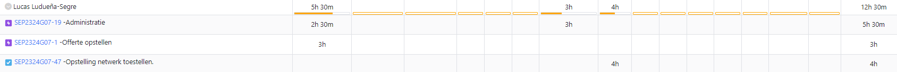

# Opvolgingsrapport week 6

## Algemeen

- Groep: G07
- Periode: 07/03/24 tot 20/03/24
- Datum voortgangsgesprek: 21/03/2024

| Student                 | Afw. | Opmerking |
| :---------------------- | :--: | :-------- |
| Matteo Alexander        |      |           |
| Emiel Lauwers           |      |           |
| Arthur Van Ginderachter |      |           |
| Lucas Ludueña-Segre     |      |           |
| Bert Coudenys           |      |           |

## Wat heb je deze periode gerealiseerd?

### Algemeen

- De basisopstelling van Linux is volledig afgewerkt.
- De testplannen voor de databank en webserver zijn geschreven.
- De packet tracer configuratie is verder uitgebreid: ACL rules toegevoegd, optimalisatie netwerk devices voor tftp.
- Windows server scripts die zijn geschreven en werken: DC, DHCP, Groups&Users, Installeren RSAT-tools.
- Windows server scripts die zijn geschreven en bijna werken: DNS, Client config/toevoegen aan domein dc.
- Netwerk opstelling nagebouwd op fysieke apperatuur voor onze opstelling te testen.
- Uitbreiding voor extra website gemaakt .
- Uitbreiding voor reverse proxy hardening gemaakt.

#### KanBan

#### Tijdsregistratie

#### Cumulatief flowdiagram

### Matteo Alexander

<!-- Voeg hier een overzicht toe van gerealiseerde taken inclusief links naar relevante commits/documenten. -->

- Testplan geschreven voor databank en webserver -> SEP2324G07-45
- Script geschreven voor RSAT-tool -> SEP2324G07-22
- Script geschreven voor de WinClient het domein van de DC te laten joinen -> SEP2324G07-22
- Andere windows server scripts uitgevoerd en getest
- Lastenboek geüpdate -> SEP2324G07-49
- Presentatie gegeven over de offerte.

<!-- Voeg hier een screenshot van het individueel tijdregistratierapport, met overzicht van elke taak en bijhorende uren. -->

### Emiel Lauwers

<!-- Voeg hier een overzicht toe van gerealiseerde taken inclusief links naar relevante commits/documenten. -->

- Script geschreven voor DC, DHCP, DNS, Groups&Users, Client -> SEP2324G07-22
- Uitbreiding redunante windows server toegevoegd aan script voor het opzetten van de vm's. -> SEP2324G07-22
- Windows configuratie getest met fysieke apperatuur -> SEP2324G07-47
- Presentatie gegeven over de offerte.

<!-- Voeg hier een screenshot van het individueel tijdregistratierapport, met overzicht van elke taak en bijhorende uren. -->

### Arthur Van Ginderachter

<!-- Voeg hier een overzicht toe van gerealiseerde taken inclusief links naar relevante commits/documenten. -->

- Verdere uitwerking linux.
- Uittesten netwerk met de poging de dns server te laten werken met de reverse proxy en web server. Dit is helaas niet gelukt maar we proberen verder te troubleshooten. -> SEP2324G07-47
- Uitbreiding linux: extra website uitgewerkt. -> SEP2324G07-40
- Uitbreiding linux: de reverse proxy hardening uitgewerkt. -> SEP2324G07-41
- Nog kleine tweaks aangepast voor het vebeteren van de scripts en automatiseringen, extra uitleg en documentaties toegevoegd in de code. -> SEP2324G07-10
- Presentatie gegeven over de offerte.

<!-- Voeg hier een screenshot van het individueel tijdregistratierapport, met overzicht van elke taak en bijhorende uren. -->

### Lucas Ludueña-Segre

<!-- Voeg hier een overzicht toe van gerealiseerde taken inclusief links naar relevante commits/documenten. -->

- Opstellen Lastenboek voor Linux en Windows. -> SEP2324G07-19
- Presentatie gegeven over de offerte.
- De netwerk opstelling op de fysieke apperatuur getest (TFTP server werkt). -> SEP2324G07-47
- Bespreking verdere opdrachtverdeling met team.
<!-- Voeg hier een screenshot van het individueel tijdregistratierapport, met overzicht van elke taak en bijhorende uren. -->

### Bert Coudenys

<!-- Voeg hier een overzicht toe van gerealiseerde taken inclusief links naar relevante commits/documenten. -->

- Presentatie gegeven over de offerte.
- Configuraties van netwerk devices geoptimaliseerd/aangepast om te werken op toestellen via TFTP.
- Configureren van ACL regels om toegang tot het internet toe te laten voor de clients. -> SEP2324G07-46

## Wat plan je volgende periode te doen?

### Algemeen

<!-- Voeg hier de doelstellingen toe voor volgende periode. -->

- Perfectioneren en afwerken van de configuraties voor de basisopdracht.
- Alle servers testen op de fysieke apperatuur
- Uitwerken uitbreiding Trunk bridged (TFTP) VM 
- Verder uitwerken van Windows server en windows client automatisatie (DNS).
- Testplannen schrijven voor TFTP server, Reverse proxy server, Windows servers.

### Matteo Alexander

- Helpen met DNS script voor windows server.
- Testen windows scripts.
- Helpen waar nodig voor de uitbreiding.
- Schrijven testrapporten van TFTP en reverse proxy server.

### Emiel Lauwers

- Automatisatie windows scripts perfectionaliseren.
- Uitbreiding redunante router afwerken.
- Helpen bij eventueel andere problemen.

### Arthur Van Ginderachter

- Uitwerken uitbreiding: Trunk bridged (TFTP) VM.
- Eventueel starten met Nextcloud uitbreiding
- Helpen waar nodig

### Lucas Ludueña-Segre

- Helpen bij eventuele uitbreidingen op linux.
- Testplannen schrijven TFTP en reverse proxy server.
- Testrappoten schrijven voor de web server en databank server.

### Bert Coudenys

- Zorgen dat mijn configuraties goed overgaan op effectieve hardware.
- HSRPv2 implementeren.
- Helpen bij de uitbreidingen van Linux waar nodig.
- Indien basisopstelling perfect werkt eventueel starten met Uitbreiding voor netwerken.

## Retrospectieve

### Wat doen jullie goed?

- Taken zijn goed verdeeld, iedereen doet zijn deel.
- Communicatie gaat ook zeer vlot. We hebben een Discord-server en iedereen reageert altijd binnen acceptabele tijd.
- Technische kennis. Er is duidelijk veel ervaring en technische kennis aanwezig in deze groep!
- Iedereen wilt elkaar helpen indien iemand vast zit.

### Waar hebben jullie nog problemen mee?

- Structuur: Hoewel we al aardig gevorderd zijn in het project en enkele uitbreidingen hebben afgerond, blijven bepaalde minder plezierige taken zoals het opstellen van testplannen en -rapporten soms lang aanhouden.

### Feedback

#### Groep

#### Matteo Alexander

#### Emiel Lauwers

#### Arthur Van Ginderachter

#### Lucas Ludueña-Segre

#### Bert Coudenys
