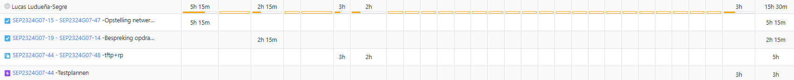

# Opvolgingsrapport week 6

## Algemeen

- Groep: G07
- Periode: 21/03/24 tot 17/04/24
- Datum voortgangsgesprek: 18/04/2024

| Student                 | Afw. | Opmerking |
| :---------------------- | :--: | :-------- |
| Matteo Alexander        |      |           |
| Emiel Lauwers           |      |           |
| Arthur Van Ginderachter |      |           |
| Lucas Ludueña-Segre     |      |           |
| Bert Coudenys           |      |           |

## Wat heb je deze periode gerealiseerd?

### Algemeen

- De basisopstelling van Windows is volledig afgewerkt.
- De testplannen voor de Winclient en extra website zijn geschreven.
- De packet tracer configuratie is verder uitgebreid: ACL rules toegevoegd, optimalisatie netwerk devices voor tftp.
- Bepaalde testplannen zijn aangepast na feedback.
- Testrapporten worden gemaakt (TFTP af, RP begonnen).
- Uitbreiding voor tftp en databank op 1 server te draaien .
- Uitbreiding voor tftp te combineren met bridged native vlan.
- Feedback toegepast voor Windows Server.

#### KanBan

#### Tijdsregistratie

#### Cumulatief flowdiagram week 8

#### Cumulatief flowdiagram gehele periode

### Matteo Alexander

<!-- Voeg hier een overzicht toe van gerealiseerde taken inclusief links naar relevante commits/documenten. -->

- Testplan geschreven voor Winclient en extra website -> SEP2324G07-59
- Testrapport geschreven voor TFTP server -> SEP2324G07-67
- Andere windows server scripts uitgevoerd en getest
- Lastenboek geüpdate -> SEP2324G07-19

<!-- Voeg hier een screenshot van het individueel tijdregistratierapport, met overzicht van elke taak en bijhorende uren. -->

### Emiel Lauwers

<!-- Voeg hier een overzicht toe van gerealiseerde taken inclusief links naar relevante commits/documenten. -->

- Scripts afgewerkt voor DC, DHCP, DNS, Groups&Users, Client -> SEP2324G07-22
- Uitbreiding redunante windows server toegevoegd aan script voor het opzetten van de vm's. -> SEP2324G07-22
- Updaten scripts voor gegeven feedback Windows -> SEP2324G07-22

<!-- Voeg hier een screenshot van het individueel tijdregistratierapport, met overzicht van elke taak en bijhorende uren. -->

### Arthur Van Ginderachter

<!-- Voeg hier een overzicht toe van gerealiseerde taken inclusief links naar relevante commits/documenten. -->

- Verdere uitwerking linux uitbreiding.
- Uitbreiding voor tftp te combineren met bridged native vlan. -> SEP2324G07-61

<!-- Voeg hier een screenshot van het individueel tijdregistratierapport, met overzicht van elke taak en bijhorende uren. -->

### Lucas Ludueña-Segre

<!-- Voeg hier een overzicht toe van gerealiseerde taken inclusief links naar relevante commits/documenten. -->

- Testplan opstellen voor Reverse proxy en tftp server -> SEP2324G07-48
- Alle testplannen aanpassen door feedback -> SEP2324G07-44 

<!-- Voeg hier een screenshot van het individueel tijdregistratierapport, met overzicht van elke taak en bijhorende uren. -->

### Bert Coudenys

<!-- Voeg hier een overzicht toe van gerealiseerde taken inclusief links naar relevante commits/documenten. -->

- Heb het netwerk klaar gemaakt voor gebruik van de windows server DHCP sever. SEP2324G07-57
- Voorbereid met team op voorstelling van ons project. SEP2324G07-57
- Scripts testen en updaten voor de voorstelling van ons project. SEP2324G07-47
- Voorstelling van project goed laten aflopen. SEP2324G07-14
- ACL's herbekeken voor uittesten na de vakantie. SEP2324G07-46
- HSRP voor ipv6 herbekeken voor testen na de vakantie. SEP2324G07-63
- HSRP voor ipv6 getest en doen werken. SEP2324G07-63

## Wat plan je volgende periode te doen?

### Algemeen

<!-- Voeg hier de doelstellingen toe voor volgende periode. -->

- Zoveel mogelijk uitbreidingen afwerken
- testrapporten schrijven voor alle testplannen

### Matteo Alexander

- Afwerken testrapport Reverse Proxy
- Helpen waar nodig voor de uitbreiding.

### Emiel Lauwers

- Automatisatie windows scripts perfectionaliseren.
- Uitbreiding redunante router afwerken.
- Helpen bij eventueel andere problemen.

### Arthur Van Ginderachter

- Uitwerken uitbreiding: Trunk bridged (TFTP) VM.
- Eventueel starten met Nextcloud uitbreiding
- Helpen waar nodig
  

### Lucas Ludueña-Segre

- Helpen bij eventuele uitbreidingen op linux.
- Nextcloud uitbreiding opzetten
- Testrapporten schrijven voor de web server en databank server.

### Bert Coudenys

- Zorgen dat mijn configuraties goed overgaan op effectieve hardware.
- HSRPv2 implementeren.
- Helpen bij de uitbreidingen van Linux waar nodig.
- Indien basisopstelling perfect werkt eventueel starten met Uitbreiding voor netwerken.
- ACL rules implementeren

## Retrospectieve

### Wat doen jullie goed?

- Taken zijn goed verdeeld, iedereen doet zijn deel.
- Communicatie gaat ook zeer vlot. We hebben een Discord-server en iedereen reageert altijd binnen acceptabele tijd.
- Technische kennis. Er is duidelijk veel ervaring en technische kennis aanwezig in deze groep!
- Iedereen wilt elkaar helpen indien iemand vast zit.
- We zitten mooi op schema.

### Waar hebben jullie nog problemen mee?

- /

### Feedback

#### Groep

#### Matteo Alexander

#### Emiel Lauwers

#### Arthur Van Ginderachter

#### Lucas Ludueña-Segre

#### Bert Coudenys

## Uitbreidingen

### Afgewerkt

- IPV6 netwerk ready/ future proof  (compleet)
- Redunante Routers  (compleet)
- Extra webserver (compleet)
- Reverse Proxy Hardening (compleet)
- Redunante router (compleet)

### In ontwikkeling

- Backup server windows (ontwikkeling)
- TFTP bridge VM (onder voorbehoud van Meneer Van Maele)
- Nextcloud (ontwikkeling)
- Nat portforwarding (testen in les)
- Bitwarden/Vaultwarden