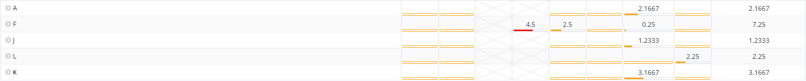
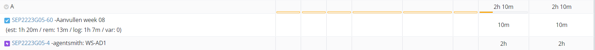

# Opvolgingsrapport 8

## Algemeen

- Groep: G05
- Periode: 12/04/2023 - 19/04/2023
- Datum voortgangsgesprek: 20/04/2023

| Student  | Aanw. | Opmerking |
| :------- | :---- | :-------- |
| Annelies |       |           |
| Florian  |       |           |
| Jan      | X     | Gewettigd |
| Laura    |       |           |
| Kasper   |       |           |

## Wat heb je deze periode gerealiseerd?

### Algemeen

- Testplannen aangevuld
- Bug uit AD gehaald (user aanmaken)
- Dozer script (configuratie, nog niet persistent)
- Netwerkconfiguratie (Switches, ACLs)

#### KanBan

#### Tijdsregistratie

#### Cummulatief flow diagram

Cumulative Flow Diagram (periode)

Cumulative Flow Diagram (volledig project)

### Annelies

- AD finaliseren (hoofdzakelijk bugfix shares voor homes/profiles)
- Testplannen en -rapporten AD voorbereiden!

### Florian

- Testplannen
- AD
- Dozer

### Jan

- Testplannen aanvullen

### Laura

- Email server verder uitgeprobeerd

### Kasper

- Configuratie verder aanvullen switch
- labels aangepast van packet tracer

## Wat plan je de volgende periode te doen?

### Team

- Testplannen & Testrapporten!!!
- AD afwerken!
- Email afwerken
- Dozer afwerken

### Annelies

- AD zonder GUI implementeren als afgewerkt
- Testplan AD volledig afwerken

### Florian

- Dozer
- AD

### Jan

- Dozer
- Mailserver

### Laura

- Email
- Email CLI

### Kasper

- Dozer
- ACL voor multilayer switch uitwerken
- Finale configuratie switchen (switchports, etc)

## Retrospectieve

### Wat doen jullie goed?

- Organisatie zit heel goed
- Duidelijke afspraken

### Waar hebben jullie nog problemen mee?

- Onderrapportering tijdsregistratie
- Op gang komen na het paasreces duurt wat langer dan gewenst
- TESTPLANNEN UITSCHRIJVEN VOLLEDIG

### Feedback proces

#### Groep

- Probeer het tempo dat jullie hadden voor de paasvakantie terug te vinden.
- Hou jullie administratie goed bij. Log voor de zekerheid elke prestatie na afwerken, wacht er niet mee tot einde van de week!
- Mooie vooruitgang, keep it up!
